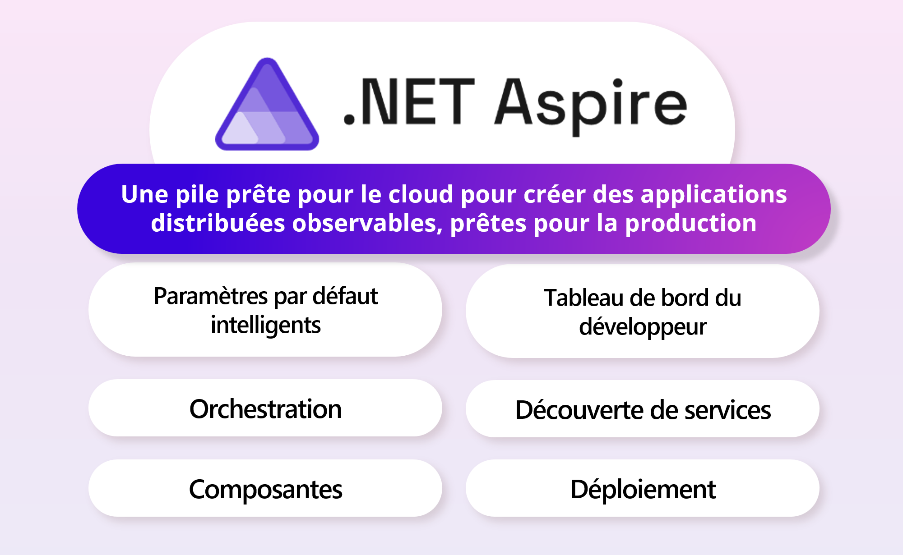

En mai dernier, durant Microsoft Build, .NET Aspire a été officiellement annoncé. Cette nouvelle pile prête pour le cloud et conçue pour .NET, visant à permettre aux développeurs de créer rapidement et facilement des applications natives cloud.

Que ce soit pour une toute petite application ou une solution complexe comprenant plusieurs microservices, .NET Aspire est conçu pour vous aider à démarrer rapidement et à évoluer en toute confiance.

Dans la vidéo francophone suivante, je vous démontre pas-à-pas comment ajouter .NET Aspire à une application existante, dans le confort de Visual Studio 2022.

<iframe width="560" height="315" src="https://www.youtube.com/embed/jJiqqVPDN4w?si=TkohTJoFyWrhZo3a" title="YouTube video player" frameborder="0" allow="accelerometer; autoplay; clipboard-write; encrypted-media; gyroscope; picture-in-picture; web-share" referrerpolicy="strict-origin-when-cross-origin" allowfullscreen></iframe>

## Chapitres

- [Mise en contexte](https://www.youtube.com/live/jJiqqVPDN4w?si=yvGQZUahsJRUVy46&t=484)
- [Quand utiliser .NET Aspire](https://www.youtube.com/live/jJiqqVPDN4w?si=q1BxJOaOrW3WByS3&t=934)
- [Application avant l'ajout de .NET Aspire](https://www.youtube.com/live/jJiqqVPDN4w?si=q0fj5UJ5MEmWOR_b&t=1484)
- [Demo 1 - Ajout des Paramètres par défaut intelligents](https://www.youtube.com/live/jJiqqVPDN4w?si=W4oWt2Qez-vxo2Iv&t=2222)
- [Tableau de bord du développeur](https://www.youtube.com/live/jJiqqVPDN4w?si=v7yQcb7ZK2RF1pm2&t=3411)
- [Demo 3 - Orchestration](https://www.youtube.com/live/jJiqqVPDN4w?si=miBtoWcYsymg-e-R&t=3729)
- [Demo 4 - Découverte de services](https://www.youtube.com/live/jJiqqVPDN4w?si=sGXlFw2lYurF1itF&t=4852)
- [Demo 5 - Ajout de composante](https://www.youtube.com/live/jJiqqVPDN4w?si=0VqiM0t25mlnrzDA&t=5564)
- [Déploiement](https://www.youtube.com/live/jJiqqVPDN4w?si=0QIGm7OPB37MC48K&t=6279)
- [Autres langages et ressources](https://www.youtube.com/live/jJiqqVPDN4w?si=F3W-b1wmDm4QhlVg&t=6545)
  

## En Conclusion

.NET Aspire peut semblé complexe au premier abord, mais c'est tout le contraire! Il est conçu pour vous aider à démarrer rapidement, quelle que soit la taille de votre application. Utilisez .NET Aspire pour que votre projet procurera une meilleure expérience pour les développeurs et simplifiera le déploiement de votre application.

Si plus de contenu en français vous intéresse, n'hésitez pas à le faire savoir en laissant un commentaire ci-dessous ou en me contactant sur les médias sociaux.

## Liens utiles

- Apprenons .NET – Aspire: https://aka.ms/letslearn/dotnet/aspire
- Documentation: https://aka.ms/dotnet-aspire
- Contenue de l'atelier/ workshop: https://github.com/dotnet-presentations/letslearn-dotnet-aspire

