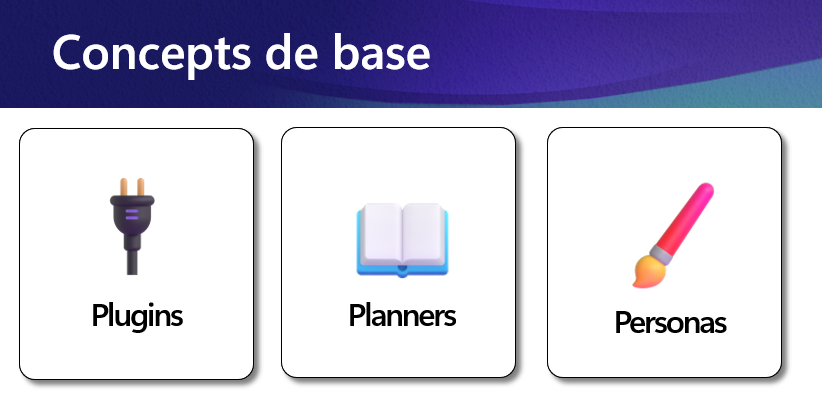

Le noyau sémantique (Semantic Kernel) est un SDK [open source](https://github.com/microsoft/semantic-kernel) qui permet aux développeurs de créer leurs propres agents artificiellement intelligents (IA). Le noyau est une couche d'abstraction qui simplifie l'accès aux API d'IA, telles que celles d'OpenAI, et permet aux développeurs de créer des agents IA qui peuvent comprendre et répondre à des messages en langage naturel pour accomplir une variété de tâches.

Microsoft à publié un [chemin d'apprentissage (Learning Path)](https://learn.microsoft.com/credentials/applied-skills/develop-ai-agents-using-microsoft-azure-openai-and-semantic-kernel/?WT.mc_id=dotnet-147962-juyoo), complètement gratuit, qui vous permet d'apprendre à l'aide d'exercices complets, comment développer des agents IA et maitriser ses trois concepts de base. 

 

- Plugins: utilisez les API que vos équipes gèrent déjà avec l'IA pour obtenir des données et effectuer des tâches.
- Planner: utiliser des plugins avec le modèle pour créer une séquence de tâches basée sur le raisonnement.
- Persona: À l'aide de plugins et de planificateurs, les agents IA peuvent interagir avec vos systèmes et aider vos utilisateurs à accomplir leur travail.

Pour bien démarrer votre apprentissage, voici une vidéo francophone, dans laquelle j'explique où les principes de base du noyau sémantique font les deux premiers modules (sur six) du chemin l'apprentissage. 

<iframe width="560" height="315" src="https://www.youtube.com/embed/mrjcb60lSc8?si=TiCp3v2vYnXxoP1x" title="YouTube video player" frameborder="0" allow="accelerometer; autoplay; clipboard-write; encrypted-media; gyroscope; picture-in-picture; web-share" referrerpolicy="strict-origin-when-cross-origin" allowfullscreen></iframe>

## En Conclusion

Le noyau sémantique (Semantic Kernel) est un outil fantastique pour les développeurs qui souhaitent créer des agents IA. Il permet de faire abstraction des particularités que chaque modèle a et de se concentrer sur la création de l'agent. Donc peu importe le modèle utilisé, qu'il soit hébergé dans le cloud ou local, votre code restera le même.

## Liens utiles

- Collection officiel à propos du noyau sémantique: [https://aka.ms/letslearn/dotnet/SK](https://aka.ms/letslearn/dotnet/SK)
- Cloud Skills Challenge: [https://aka.ms/letslearn/dotnet/SK/csc](https://aka.ms/letslearn/dotnet/SK/csc)
- Évaluation: [https://aka.ms/letslearn/dotnet/SK/credentials](https://aka.ms/letslearn/dotnet/SK/credentials)

