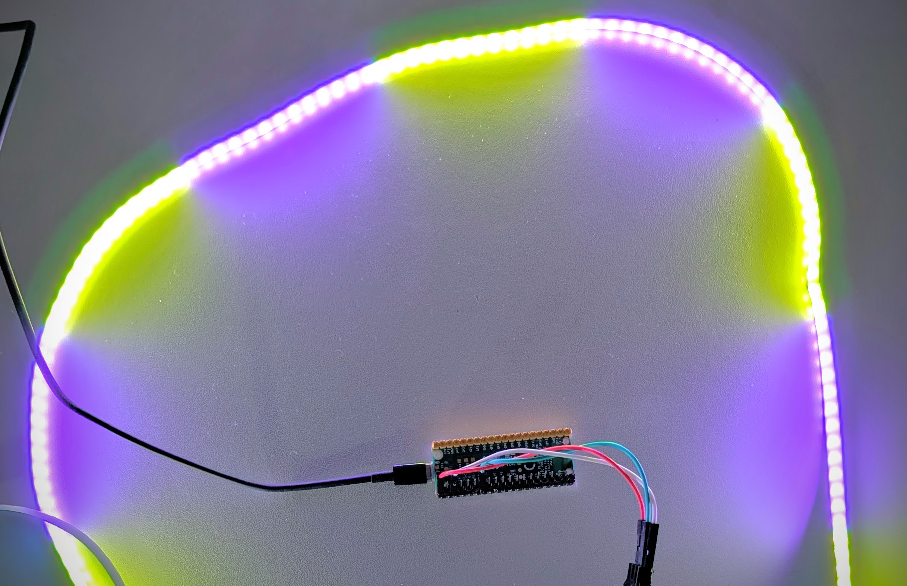
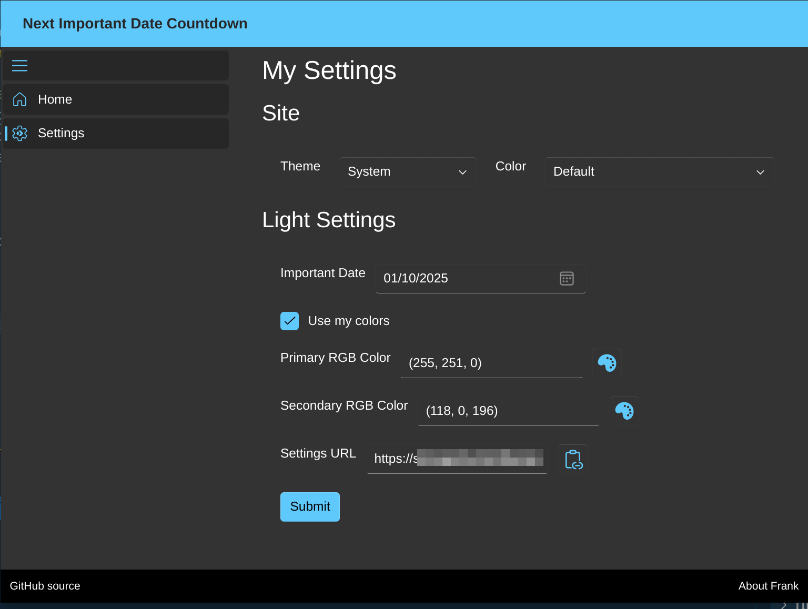

# Compte à rebours visuel des jours jusqu'à [une date]

Pendant les vacances, j'ai entrepris un projet amusant pour créer un compte à rebours visuel pour une dates importantes. Inspiré par [howmanysleeps](https://github.com/veebch/howmanysleeps) et [hometime](https://github.com/veebch/hometime) de [veebch](https://github.com/veebch), je voulais construire un compte à rebours qui ne dépendait pas de Google Calendar. À la place, j'ai utilisé un Raspberry Pi Pico et du code personnalisé pour y parvenir.

💾 Vous pouvez trouver le code complet sur [GitHub](https://github.com/FBoucher/DaysUntilNextEvent)



## Qu'est-ce que c'est

Ce projet se compose de deux parties principales :
- Code Python pour le Raspberry Pi Pico
- Un site web .NET pour mettre à jour la configuration, vous permettant de définir :
  - La date importante
  - Deux couleurs personnalisées ou aléatoires
  - Les valeurs RGB pour les couleurs personnalisées




## Ce dont vous avez besoin

- [Raspberry Pi Pico](https://www.raspberrypi.com/products/raspberry-pi-pico/)
- [Abonnement Azure](portal.azure.com)
- Bande LED BTF-LIGHTING XGB1338(WS2812B) DC5V avec LED adressable individuellement
- [Azure Developer CLI (azd)](https://learn.microsoft.com/azure/developer/azure-developer-cli)


## Comment déployer le site de configuration

Après avoir cloné le dépôt (Gihub repo), naviguez vers le dossier `src/NextEvent/` et utilisez l'[Azure Developer CLI (AZD)](https://learn.microsoft.com/azure/developer/azure-developer-cli/install-azd) pour initialiser le projet :

```bash
azd init
```

Entrez un nom significatif pour votre groupe de ressources dans Azure. Pour déployer, utilisez la commande de déploiement :

```bash
azd up
```

Spécifiez l'abonnement Azure et l'emplacement lorsque vous y êtes invité. Après quelques minutes, tout devrait être déployé. Vous pouvez accéder à l'URL depuis la sortie dans le terminal ou la récupérer depuis le portail Azure.

## Comment configurer le Raspberry Pi Pico

Modifiez le fichier `config.py` pour ajouter vos informations Wi-Fi et mettre à jour le nombre de lumières sur votre bande lumineuse.

Vous pouvez utiliser [Thonny](https://thonny.org/) pour copier le code Python sur l'appareil. Copiez à la fois main.py et config.py sur le Raspberry Pi Pico.

## Comment ça fonctionne
- Le site web crée un fichier JSON et le sauvegarde dans un stockage Azure accessible publiquement.
- Lorsque le Pi est allumé, il va :
  - Allumer en vert une par une toutes les lumières de la bande
  - Changer la couleur de toute la bande lumineuse plusieurs fois, puis l'éteindre
  - Essayer de se connecter au Wi-Fi
  - Récupérer le fuseau horaire, la date actuelle et les paramètres du fichier JSON
  - Si la date importante est dans les 24 jours, le compte à rebours sera affiché en utilisant des couleurs aléatoires ou les couleurs spécifiées.
  - Si la date est passée, la bande lumineuse affichera un effet de respiration avec une couleur aléatoire du jour.


## Le code sur le Raspberry Pi Pico

Le code principal pour le Raspberry Pi Pico est écrit en Python. Voici un bref aperçu de ce qu'il fait :

1. **Se connecter au Wi-Fi** : La fonction connect_to_wifi connecte le Raspberry Pi Pico au réseau Wi-Fi spécifié.
1. **Obtenir le fuseau horaire et l'heure locale** : Les fonctions get_timezone et get_local_time récupèrent le fuseau horaire actuel et l'heure locale en utilisant des API en ligne.
1. **Récupérer les paramètres de la lumière** : La fonction get_light_settings récupère la date importante et les couleurs RGB du fichier JSON stocké dans Azure.
1. **Calculer les jours jusqu'au jour spécial** : La fonction sleeps_until_special_day calcule le nombre de jours jusqu'à la date importante.
1. **Contrôler la bande LED** : La fonction progress contrôle la bande LED, affichant le compte à rebours ou un effet de respiration en fonction de la date actuelle et des paramètres.


## Le site de configuration

Le site de configuration est construit en utilisant .NET et vous permet de mettre à jour les paramètres pour le Raspberry Pi Pico. Vous pouvez définir la date importante, choisir des couleurs personnalisées et sauvegarder ces paramètres dans un fichier JSON dans le stockage Azure.

## Petit extra

Le site est déployé dans Azure Container App avec une mise à l'échelle minimale à zéro pour économiser sur les coûts. Cela peut causer un léger délai lors du chargement du site pour la première fois, mais il fonctionnera parfaitement et retournera en mode "dormant" après un certain temps.

J'espère que vous avez apprécié lire sur mon projet de vacances ! Ce fut une expérience amusante et éducative, et j'ai hâte de travailler sur d'autres projets comme celui-ci à l'avenir.

## Prochaines étapes?

Actuellement, le projet fait un compte à rebours de 24 jours (inspiré du calendrier de l'avent). J'aimerais ajouter une fonctionnalité permettant à l'utilisateur de définir le nombre de jours pour le compte à rebours. J'aimerais également ajouter la possibilité de définir la couleur pour l'effet de respiration (ou de la garder aléatoire) lorsque la date importante est passée. Et enfin, j'aimerais ajouter l'heure de la journée où la bande lumineuse doit s'allumer et s'éteindre, car nous avons tous des horaires différents 😉.

## Dernières pensées

J'ai vraiment apprécié faire ce projet. C'était une façon amusante d'en apprendre davantage sur le Raspberry Pi Pico, micro-Python (je ne savais même pas que c'était une chose), et FluentUI Blazor. J'espère que vous avez apprécié lire à ce sujet et que cela vous a inspiré à créer vos propres projets amusants. Si vous avez des questions ou des suggestions, n'hésitez pas à me contacter, je suis [fboucheros](https://bsky.app/profile/fboucheros.bsky.social) sur la plupart des réseaux sociaux. 

