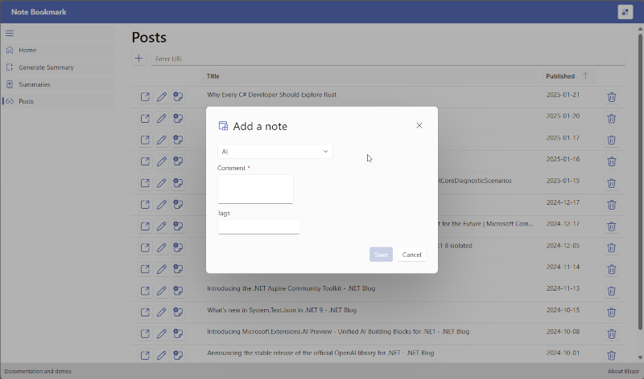

> *Version en anglais disponible sur [techcommunity.microsoft.com](https://techcommunity.microsoft.com/blog/appsonazureblog/how-i-build-notebookmark-using-c-and-my-azure-container-app/4374273)*

J'aime lire. Je lis dans les transport en commun, à la maison, le matin ou le soir. Je lis bien sûr des livres, mais aussi beaucoup de d'article de blog et d'articles pour rester à jour avec les technologies. À l'occasion, une question ou un sujet surgit et je me souviens avoir lu quelque chose à ce sujet, mais je ne me souviens plus où. J'ai donc décidé de créer une application simple pour m'aider à suivre les articles que je lis, avec mes réflexions personnelles à leur sujet. Je l'ai appelée NoteBookmark. Je l'utilise aussi pour écrire mon *post* hebdomadaire sur [Reading Notes](https://www.frankysnotes.com) et pouvoir retrouver tous les articles que j'ai lus.

Dans ce *post*, je vais partager comment j'ai construit NoteBookmark en expliquant les choix que j'ai faits et les technologies que j'ai utilisées. C'est une application réelle que j'utilise tous les jours, elle est toujours en cours de développement et elle est open source. Vous pouvez trouver le code source sur mon dépôt GitHub [NoteBookmark](https://github.com/FBoucher/NoteBookmark)



## L'Architecture

NoteBookmark est une application simple. Il y a un *frontend*, un *backend* et un stockage de données. Le *frontend* est une application web .NET Blazor, le *backend* est une API minimale .NET et les données sont stockées dans une table d'Azure Storage. Le frontend et le backend sont hébergés dans Azure Container Apps.


Azure Container Apps fournit des fonctionnalités d'authentification et d'autorisation intégrées (parfois aussi appelées "Easy Auth"), pour sécuriser votre conteneur avec accès externe. Le *frontend* est sécurisé avec Easy Auth et l'API backend n'est pas exposée à Internet.

### Pourquoi cette pile technologique?

J'ai choisi Azure Container Apps parce que c'est un service entièrement géré qui me permet d'exécuter mes applications conteneurisées sans avoir à gérer l'infrastructure sous-jacente. Je suis le seul utilisateur de NoteBookmark, donc je peux le réduire à zéro (0) lorsque je ne l'utilise pas, et en même temps économiser de l'argent. Les fonctionnalités d'authentification et d'autorisation sont intégrées et faciles à configurer; aucun code requis. Le fait que l'API ne soit pas exposée à Internet est un plus pour moi. Je n'ai pas à m'inquiéter de la sécuriser, et je peux me concentrer sur les fonctionnalités que je veux développer.

La table d'Azure Storage est un moyen simple et bon marché de stocker les données. Je n'ai pas besoin d'une base de données relationnelle pour cette application. La table de stockage Azure est un magasin de valeurs-clés NoSQL qui me permet de stocker et de récupérer des données rapidement. Elle est également facile à utiliser et à intégrer avec le SDK .NET. Si nécessaire, je peux utiliser le portail Azure ou Azure Storage Explorer pour voir les données, ce qui est toujours agréable surtout lorsque vous déboguez.

## La Solution .NET

J'ai utilisé .NET Aspire pour ce projet. .NET Aspire est un ensemble d'outils et de conseils pour vous aider à construire des applications .NET modernes. Il fournit un ensemble de meilleures pratiques, d'outils et de modèles pour vous aider à démarrer rapidement. J'ai utilisé la commande `dotnet new aspire` pour créer la solution. Ensuite, j'ai ajouté une API minimale `dotnet new webapi`, un projet de bibliothèque de classes `dotnet new classlib` et une application web Blazor qui utilise des composants FluentUi `dotnet new fluentblazor`.

```bash
NoteBookmark/
├── NoteBookmark.Api               # Projet API minimale
├── NoteBookmark.AppHost           # Projet orchestrateur Aspire
├── NoteBookmark.BlazorApp         # Projet application web Blazor
├── NoteBookmark.Domain            # Projet bibliothèque de classes
└── NoteBookmark.ServiceDefaults   # Projet des paramètres par défaut Aspire
```

### Pourquoi ces choix?

J'ai choisi l'API minimale parce que c'est une version légère d'ASP.NET Core qui me permet de construire des API simples rapidement. Je n'ai pas besoin de toutes les fonctionnalités d'une application ASP.NET Core complète pour ce projet. L'API minimale est facile à utiliser et à configurer, et elle est parfaite pour construire des microservices ou de petites API.

FluentUi Blazor est un ensemble de composants qui me permet de construire des applications web modernes avec un design et une expérience utilisateur cohérents. J'aime l'utiliser pour que mes applications aient une belle apparence tout en me concentrant sur les fonctionnalités que je veux développer. Blazor est un excellent choix pour construire des applications web avec C# et j'ai utilisé la version serveur car je savais qu'elle fonctionnerait dans un conteneur.

Le projet de bibliothèque de classes contient les classes partagées entre le frontend et le backend.

Aspire fournit un projet orchestrateur `AppHost` qui nous permet de décrire tous les services et leurs interactions en un seul endroit en C#! C'est très utile lors du travail local car un simple `F5` démarrera tous les services et s'occupera de définir tous les ports et configurations nécessaires. Et comme nous le verrons plus tard, cela aide également à déployer l'application sur Azure Container Apps, en créant un manifeste.

Voici le fichier *project* `AppHost`:

```csharp
var builder = DistributedApplication.CreateBuilder(args);

var connectionString = builder.AddConnectionString("data-storage-connstr");

var api = builder.AddProject<NoteBookmark_Api>("api")
            .WithEnvironment("data-storage-connstr", connectionString);

builder.AddProject<NoteBookmark_BlazorApp>("blazor-app")
    .WithReference(api)
    .WithExternalHttpEndpoints();

builder.Build().Run();
```

> Notez ici que seul le "blazor-app" a `.WithExternalHttpEndpoints()` et non l'"api". L'API n'est pas exposée à Internet, seul le frontend l'est. L'API est uniquement accessible depuis le frontend.

De nombreux services Azure peuvent héberger des API et des applications web. Comme c'est souvent le cas, nous ne voulons autoriser que les utilisateurs autorisés à accéder à l'API. Nous aurions pu implémenter la sécurité dans le code, en passant des jetons entre l'application web et l'API. Cela pourrait être implémenté à l'avenir pour créer un accès plus granulaire, mais pour l'instant, j'ai choisi d'utiliser la fonctionnalité Easy Auth intégrée d'Azure Container Apps. De cette façon, l'application web est sécurisée et cela ne nécessite aucun code. L'API n'est pas exposée à Internet, donc elle n'est pas accessible de l'extérieur, seuls les utilisateurs authentifiés de l'application web peuvent y accéder, en utilisant le réseau interne des Azure Container Apps.

## Déploiement et Infrastructure as Code (IaC)

J'ai utilisé l'Azure Developer CLI (azd) pour déployer NoteBookmark sur Azure Container Apps. L'Azure Developer CLI est un ensemble d'outils qui vous permet de déployer et de gérer des ressources Azure depuis la ligne de commande. En utilisant les commandes `azd init` et `azd up`, j'ai pu déployer NoteBookmark sur Azure Container Apps en quelques minutes.

Comme mentionné précédemment, je voulais que l'application se réduise à zéro lorsqu'elle n'est pas utilisée. J'ai utilisé la commande `azd infra synth` pour générer l'infrastructure en tant que code (IaC) pour l'ensemble de la solution. L'IaC est un ensemble de fichiers YAML qui décrivent les ressources nécessaires pour déployer NoteBookmark. Dans le dossier `NoteBookmark.AppHost`, j'ai un dossier `infra` qui contient deux fichiers YAML: `api.tmpl.yaml` et `blazor-app.tmpl.yaml`. Pour que l'application se réduise à zéro, j'ai changé la valeur de `minReplicas` à 0 dans les deux fichiers.

```yaml
    scale:
      minReplicas: 0
```

Ensuite, en utilisant la même commande `azd up`, j'ai pu redéployer les modifications sur Azure. Cette fois, c'était beaucoup plus rapide car les ressources étaient déjà créées.

## Pipeline CI/CD

C'est génial pour un déploiement "one shot", mais comment implémenter un pipeline CI/CD? Comme le code est sur GitHub, j'ai utilisé les GitHub Actions pour automatiser le déploiement. Une fois de plus, l'Azure Developer CLI vient à la rescousse. J'ai utilisé la commande `azd pipeline config` pour créer un fichier de workflow GitHub Action, définir tous les secrets dans GitHub. Maintenant, chaque fois que je `git push` sur la branche principale, cela déclenchera un déploiement.

## Azure Container Apps et Easy Auth

La configuration de l'Easy Auth peut être entièrement réalisée via le portail Azure. Ouvrez la ressource Azure Container Apps `blazor-app`. Dans le menu de gauche, allez dans "Authentification" puis dans la section "Paramètres". Cliquez sur "Ajouter un fournisseur" et sélectionnez "Microsoft Entra". Remplissez le formulaire avec les informations requises, et voilà! Le frontend est maintenant sécurisé avec Easy Auth. Cela signifie que vous serez invité à vous connecter avec votre compte Microsoft avant d'accéder à l'application, vous ne verrez même pas la page d'accueil avant d'être authentifié.

## Conclusion

Le projet est totalement utilisable, je l'utilise quotidiennement! Bien sûr, il y a des fonctionnalités à ajouter et des tests à écrire. Essayez-le! Allez sur le [dépôt GitHub](https://github.com/FBoucher/NoteBookmark), déployez-le et laissez des commentaires en utilisant l'onglet Issues de GitHub. C'est un projet open source, alors n'hésitez pas à contribuer ou à l'utiliser comme base pour votre propre projet. J'espère que ce billet vous aidera à construire votre propre application en utilisant Azure Container Apps et .NET Aspire.

## En savoir plus sur

 - [FluentUi Blazor](https://www.fluentui-blazor.net/)
 - [Aperçu de .NET Aspire](https://learn.microsoft.com/dotnet/aspire/get-started/aspire-overview)
 - [Azure Container Apps](https://azure.microsoft.com/services/container-apps/)
 - [Azure Storage Explorer](https://azure.microsoft.com/features/storage-explorer/)
 - [Azure Developer CLI (azd)](https://learn.microsoft.com/azure/developer/azure-developer-cli/install-azd)

