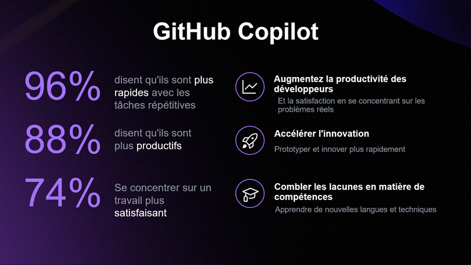

Je suis sûr que vous avez entendu parler de l'intelligence artificielle, de l'IA générative, et de la façon dont elle transforme le monde du développement logiciel. Peut-être même l'avez déjà essayer. Et probablement que vous ne saviez pas trop par où commencer. C’est parfaitement normal.

J'ai récemment diffusé une vidéo en direct sur YouTube pour montrer comment utiliser GitHub Copilot en tant que développeur .NET et le tout en français!. C’est une vidéo d’environ 2 heures où je me lance progressivement et vous explique quelques concepts de base avant de réaliser quelques démonstrations. Et croyez-le ou non, nous écrirons un jeu en quelques minutes à la fin, en utilisant GitHub Copilot pour nous aider.

Le meilleur dans tout ça, c'est que vous pouvez le faire vous aussi, gratuitement et à votre rythme! En effet, tout le contenu (vidéo, diapositives, code source sont disponibles, en français, sur GitHub.

<iframe width="560" height="315" src="https://www.youtube.com/embed/mmLqyyQAOyI?si=4fSg2xiHIvcCazN5" title="Let's Learn .NET - GitHub Copilot (French)" frameborder="0" allow="accelerometer; autoplay; clipboard-write; encrypted-media; gyroscope; picture-in-picture; web-share" referrerpolicy="strict-origin-when-cross-origin" allowfullscreen></iframe>

🎁 Collection: https://aka.ms/letslearn/dotnet/ghcp
📌 Repo: https://github.com/microsoft/mastering-github-copilot-for-dotnet-csharp-developers
🎥 Community Links: https://aka.ms/letslearn/dotnet

Si vous avez des questions ou des commentaires, n'hésitez pas à me contacter sur les réseaux sociaux. 