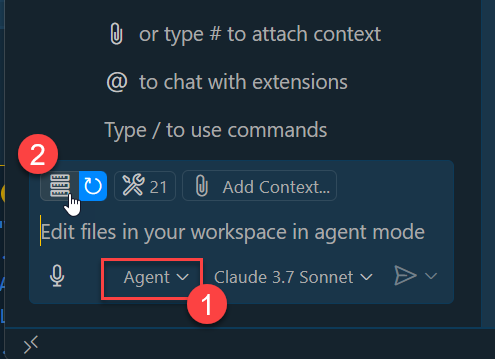
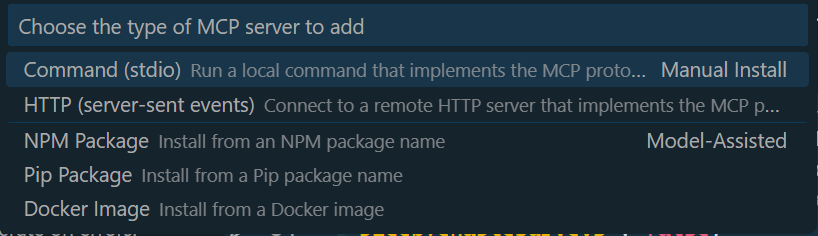
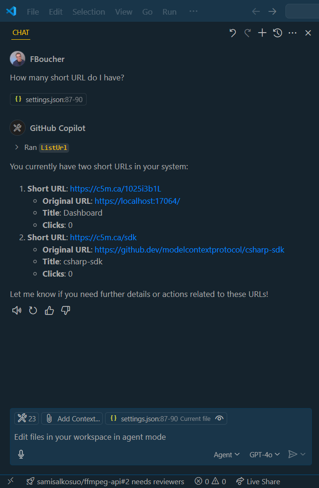

Avez-vous déjà souhaité donner à vos assistants IA accès à vos propres outils et données personnalisés? C'est exactement ce que le Model Context Protocol (MCP) nous permet de faire, et j'ai récemment expérimenté avec cette technologie.

J'ai beaucoup lu dernièrement sur le Model Context Protocol (MCP) et comment il change la façon dont l'IA interagit avec les systèmes externes. J'étais curieux de voir comment ça fonctionne et comment je pourrais l'utiliser dans mes propres projets. Il existe de nombreux tutoriels disponibles en ligne, mais l'un de mes préférés a été écrit par James Montemagno [Build a Model Context Protocol (MCP) server in C#](https://devblogs.microsoft.com/dotnet/build-a-model-context-protocol-mcp-server-in-csharp/) (en anglais). 

Cet article n'est pas un tutoriel, mais plutôt un résumé de mon expérience et de ce que j'ai appris en construisant un véritable serveur MCP qui gère des URL courtes.

## Un peu de contexte

Le MCP ne change pas l'IA elle-même, c'est un protocole qui aide votre modèle d'IA à interagir avec des ressources externes: API, bases de données, etc. Le protocole simplifie la façon dont l'IA peut accéder à un système externe, et il permet à l'IA de découvrir les outils disponibles à partir de ces ressources. Récemment, je travaillais sur un projet qui gère des URL courtes, et j'ai pensé que ce serait une excellente occasion de construire un serveur MCP qui gère des URL courtes. Je voulais voir à quel point il est facile de le construire puis de l'utiliser dans VSCode avec GitHub Copilot Chat.

> Code: Tout le code de cet article est disponible dans la branche **exp/mcp-server** du dépôt [AzUrlShortener](https://github.com/microsoft/AzUrlShortener/tree/exp/mcp-server) sur GitHub.

## Configuration: Ajouter un serveur MCP à une solution .NET Aspire

AzUrlShortener est une solution web qui utilise .NET Aspire, donc la première chose que j'ai faite a été de créer un nouveau projet en utilisant la commande:

```bash
dotnet new web -n Cloud5mins.ShortenerTools.MCPServer -o ./mcpserver
```

### Dépendances requises

Pour transformer ce projet en serveur MCP, j'ai ajouté ces packages NuGet essentiels:
- `Microsoft.Extensions.Hosting` 
- `ModelContextProtocol.AspNetCore`

Puisque ce projet fait partie d'une solution .NET Aspire, j'ai également ajouté des références à:
- Le projet `ServiceDefaults` (pour une configuration de service cohérente)
- Le projet `ShortenerTools.Core` (où réside la logique business)

### Intégration avec Aspire

Ensuite, j'ai dû intégrer le serveur MCP dans le projet `AppHost`, qui définit tous les services de notre solution. Voici comment je l'ai ajouté aux services existants:

```csharp
var manAPI = builder.AddProject<Projects.Cloud5mins_ShortenerTools_Api>("api")
						.WithReference(strTables)
						.WaitFor(strTables)
						.WithEnvironment("CustomDomain",customDomain)
						.WithEnvironment("DefaultRedirectUrl",defaultRedirectUrl);

builder.AddProject<Projects.Cloud5mins_ShortenerTools_TinyBlazorAdmin>("admin")
		.WithExternalHttpEndpoints()
		.WithReference(manAPI);

// 👇👇👇 nouveau code pour le serveur MCP
builder.AddProject<Projects.Cloud5mins_ShortenerTools_MCPServer>("mcp")
		.WithReference(manAPI)
		.WithExternalHttpEndpoints();

```

Remarquez comment j'ai ajouté le serveur MCP avec une référence à `manAPI` - c'est crucial car il a besoin d'accéder à l'API de gestion d'URL.

### Configuration du serveur MCP

Pour compléter la configuration, j'ai dû configurer l'injection de dépendances dans le fichier `program.cs` du projet MCPServer. La partie clé était de spécifier l'adresse de base du httpClient:

```csharp
var builder = WebApplication.CreateBuilder(args);       
builder.Logging.AddConsole(consoleLogOptions =>
{
    // Configure all logs to go to stderr
    consoleLogOptions.LogToStandardErrorThreshold = LogLevel.Trace;
});
builder.Services.AddMcpServer()
    .WithTools<UrlShortenerTool>();

builder.AddServiceDefaults();

builder.Services.AddHttpClient<UrlManagerClient>(client => 
            {
                client.BaseAddress = new Uri("https+http://api");
            });
            
var app = builder.Build();

app.MapMcp();

app.Run();
```

C'est tout ce qui était nécessaire! Grâce à .NET Aspire, l'intégration du serveur MCP était simple. Lorsque vous exécutez la solution, le serveur MCP démarre aux côtés d'autres projets et sera disponible à `http://localhost:{un port}/sse`. La partie `/sse` de l'endpoint signifie (Server-Sent Events) et est essentielle - c'est l'URL que les assistants IA utiliseront pour découvrir les outils disponibles.

## Implémentation des outils du serveur MCP

En regardant le code ci-dessus, deux lignes clés font fonctionner le tout:

1. `builder.Services.AddMcpServer().WithTools<UrlShortenerTool>();` - enregistre le serveur MCP et spécifie quels outils seront disponibles
2. `app.MapMcp();` - mappe le serveur MCP au pipeline ASP.NET Core

### Définition des outils avec des attributs

La classe `UrlShortenerTool` contient toutes les méthodes qui seront exposées aux assistants IA. Examinons la méthode `ListUrl`:

```csharp
[McpServerTool, Description("Provide a list of all short URLs.")]
public List<ShortUrlEntity> ListUrl()
{
	var urlList = _urlManager.GetUrls().Result.ToList<ShortUrlEntity>();
	return urlList;
}
```

L'attribut `[McpServerTool]` marque cette méthode comme un outil que l'IA peut utiliser. Je préfère garder les définitions d'outils simples, en déléguant l'implémentation réelle à la classe `UrlManager` qui est injectée dans le constructeur: `UrlShortenerTool(UrlManagerClient urlManager)`.

### Le client gestionnaire d'URL

Le `UrlManagerClient` suit les modèles standard de HttpClient. Il reçoit le httpClient pré-configuré dans son constructeur et l'utilise pour communiquer avec l'API:

```csharp
public class UrlManagerClient(HttpClient httpClient)
{
	public async Task<IQueryable<ShortUrlEntity>?> GetUrls()
    {
		IQueryable<ShortUrlEntity> urlList = null;
		try{
			using var response = await httpClient.GetAsync("/api/UrlList");
			if(response.IsSuccessStatusCode){
				var urls = await response.Content.ReadFromJsonAsync<ListResponse>();
				urlList = urls!.UrlList.AsQueryable<ShortUrlEntity>();
			}
		}
		catch(Exception ex){
			Console.WriteLine(ex.Message);
		}
        
		return urlList;
    }

	// autres méthodes pour gérer les URL courtes
}
```

Cette séparation des préoccupations maintient le code propre - les outils gèrent l'interface MCP, tandis que le client gère la communication avec l'API.

## Utilisation du serveur MCP avec GitHub Copilot Chat

Maintenant pour la partie passionnante - connecter votre serveur MCP à GitHub Copilot Chat! C'est là que vous verrez vos outils personnalisés en action.

### Configuration de Copilot pour utiliser votre serveur MCP

Une fois que le serveur est en cours d'exécution (soit déployé dans Azure ou localement), suivez ces étapes:

1. Ouvrez GitHub Copilot Chat dans VS Code
2. Changez le mode à **Agent** en cliquant sur le menu déroulant dans le panneau de chat
3. Cliquez sur le bouton **Select Tools...**, puis **Add More Tools**



### Sélection du type de connexion

GitHub Copilot prend en charge plusieurs façons de se connecter aux serveurs MCP:



Il y a plusieurs options disponibles - vous pourriez avoir votre serveur dans un conteneur ou l'exécuter via la ligne de commande. Pour notre scénario, nous utiliserons HTTP.

> **Remarque:** Au moment de rédiger cet article, j'ai dû utiliser l'URL HTTP du serveur MCP plutôt que HTTPS. Vous pouvez obtenir cette URL à partir du tableau de bord Aspire en cliquant sur la ressource et en vérifiant les **Endpoints** disponibles.

Après avoir sélectionné votre type de connexion, Copilot affichera le fichier de configuration, que vous pouvez modifier à tout moment.


### Interaction avec vos outils personnalisés

Maintenant vient la partie amusante! Vous pouvez interagir avec votre serveur MCP de deux façons:

1. **Requêtes en langage naturel**: Posez des questions comme "Combien d'URL courtes ai-je?"
2. **Références directes aux outils**: Utilisez le signe dièse pour appeler des outils spécifiques: "Avec #azShortURL liste toutes les URL"

Le `azShortURL` est le nom que nous avons donné à notre serveur MCP dans la configuration.



## Apprentissages clés et orientations futures

La construction de ce serveur MCP pour AzUrlShortener m'a appris plusieurs leçons précieuses:

### Ce qui a bien fonctionné
- L'intégration avec .NET Aspire était remarquablement simple
- L'approche basée sur les attributs pour définir les outils est propre et intuitive
- La séparation des définitions d'outils de la logique d'implémentation maintient le code maintenable

### Défis et considérations
- Le [csharp-SDK](https://github.com/modelcontextprotocol/csharp-sdk) n'a que quelques semaines et est encore en prévisualisation
- L'authentification OAuth n'est pas encore définie (bien qu'on y travaille activement)
- La documentation est présente mais évolue rapidement à mesure que la technologie mûrit, donc certaines fonctionnalités peuvent ne pas être entièrement documentées

Pour le projet AzUrlShortener spécifiquement, je conserve cette implémentation de serveur MCP dans la branche expérimentale `mcp-server` jusqu'à ce que je puisse la sécuriser correctement. Cependant, j'envisage déjà de nombreux autres scénarios où les serveurs MCP pourraient ajouter une grande valeur.

Si vous êtes intéressé à explorer cette technologie, je vous encourage à:
- Consulter le [dépôt GitHub](https://github.com/microsoft/AzUrlShortener/tree/exp/mcp-server)
- Le bifurquer et créer votre propre serveur MCP
- Expérimenter avec différents outils et capacités

### Rejoignez la communauté

Si vous avez des questions ou souhaitez partager vos expériences avec d'autres, je vous invite à rejoindre le serveur Discord de la communauté Azure AI:

[](https://discord.gg/kzRShWzttr)

L'écosystème MCP se développe rapidement, et c'est une période passionnante pour faire partie de cette communauté!