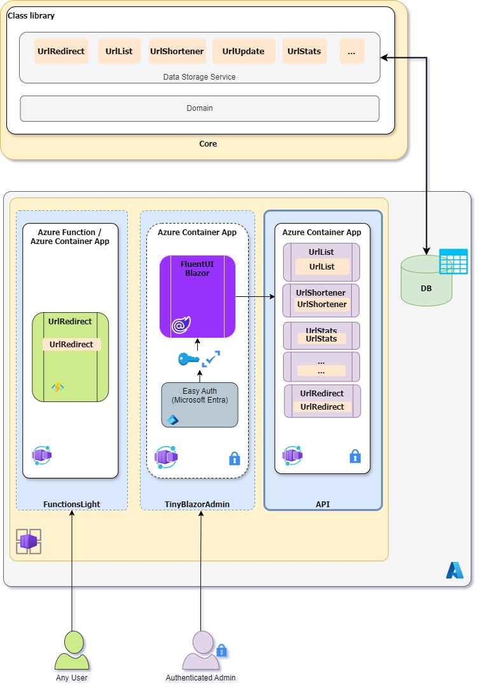

Ça fait déjà 2 ans que j'ai arrêté de travailler sur le projet AzUrlShortener. Non pas que je ne l'aimais pas, mais j'étais occupé avec d'autres projets. Récemment, l'opportunité de travailler à nouveau sur ce projet s'est présentée, et j'ai sauté dessus. Tellement de choses ont changé en deux ans, et j'étais excité de voir comment je pourrais améliorer l'expérience de développement de la solution et moderniser l'interface utilisateur et l'architecture.

Ce billet est le premier d'une série où je partage quelques détails intéressants, astuces et trucs que j'ai appris en travaillant sur ce projet.

> [AzUrlShortener](https://github.com/microsoft/AzUrlShortener) est un projet Open source qui consiste en un simple raccourcisseur d'URL. L'objectif était simple: avoir une solution économique pour partager des URLs courtes qui serait sécurisée, facile à utiliser, et où les données resteraient les nôtres. Chaque instance est hébergée dans Azure et consistait auparavant d'une API (Azure Function), un site web Blazor WebAssembly (Azure Static Web App), et un stockage de données (Azure Storage table).

## Principaux changements en un coup d'œil
- Migration d'Azure Static Web Apps vers Azure Container Apps
- Mise à niveau vers .NET 9.0 et intégration avec .NET Aspire
- Sécurité améliorée avec des responsabilités d'API séparées
- Déploiement simplifié utilisant Azure Developer CLI (azd)
- Interface utilisateur moderne avec FluentUI Blazor

## Mise à niveau des SDKs et des packages

Comme mentionné précédemment, beaucoup de choses ont changé en deux ans. La première chose que j'ai faite a été de mettre à niveau les SDKs vers .NET 9.0. C'était un jeu d'enfant; j'ai changé le framework cible dans le fichier projet puis utilisé `dotnet-updated` pour lister tous les packages qui avaient besoin d'être mis à jour. J'ai ensuite utilisé `dotnet outdated -u` pour mettre à jour tous les packages.

Et pendant que j'y étais, comme j'ai commencé à utiliser .NET Aspire, je n'ai pas pu résister à l'utiliser autant que possible. Il simplifie tellement le cycle de développement, et le code est beaucoup plus propre. Alors je l'ai ajouté au mélange. Cela a ajouté deux projets supplémentaires à la solution, mais maintenant l'ensemble de la solution est défini en C# dans le projet AppHost (l'orchestrateur Aspire).

Donc maintenant la solution ressemble à ceci:

```bash
src/
├── Cloud5mins.ShortenerTools.Api        # API de gestion interne
├── Cloud5mins.ShortenerTools.AppHost    # Orchestrateur .NET Aspire
├── Cloud5mins.ShortenerTools.Core       # Logique métier partagée
├── Cloud5mins.ShortenerTools.FunctionsLight  # API de redirection publique
├── Cloud5mins.ShortenerTools.ServiceDefaults # Configurations de service communes
└── Cloud5mins.ShortenerTools.TinyBlazorAdmin # Application frontend
```

## Changements pour améliorer la sécurité

La sécurité devrait passer en premier, et je voulais m'assurer que la solution était aussi sécurisée que possible. J'ai décidé de diviser l'API en deux parties. La première partie est l'API qui redirige les utilisateurs, et elle ne peut faire que cela. La deuxième partie est l'API interne pour gérer toutes les URLs et autres données.

J'ai décidé de migrer la solution pour utiliser Azure Container Apps et de la faire fonctionner dans deux conteneurs: le TinyBlazorAdmin et l'Api. Avec Azure Container Apps, je peux utiliser Microsoft Entra, sans aucune ligne de code, pour sécuriser TinyBlazorAdmin. L'API ne sera accessible que depuis TinyBlazorAdmin et ne sera pas exposée à Internet. En bonus, puisque TinyBlazorAdmin et l'API fonctionnent maintenant dans des conteneurs, vous pourriez également décider de les exécuter localement.

L'accès au stockage a également bénéficié d'une amélioration de sécurité. Au lieu d'utiliser une chaîne de connexion, j'utiliserai une Managed Identity pour accéder à Azure Storage Table. C'est une façon beaucoup plus sécurisée d'accéder aux ressources Azure, et grâce à .NET Aspire, c'est également très facile à implémenter.

## Architecture

L'architecture change un peu. L'API est maintenant divisée en deux: **FunctionsLight** et **API**. Les deux APIs utilisent des services de **Core** pour éviter la duplication de code. Le **TinyBlazorAdmin** fonctionne dans un conteneur et est sécurisé par Microsoft Entra. L'API fonctionne également dans un conteneur et n'est pas exposée à Internet. Et Azure Storage Table reste notre fidèle source de données.

### Architecture précédente

- Azure Function (API)
- Azure Storage (Code Function)
- Azure Static Web App (Blazor WebAssembly)
- Azure Storage Table (Données)
- Application Insights

### Nouvelle architecture

- Container registry (Images Docker)
- Container Apps Environment
    * Container App/ Function: **FunctionsLight** API de redirection publique uniquement
    * Container App: **API interne** Interface de gestion protégée
    * Container App: **TinyBlazorAdmin** Site web Blazor sécurisé
- Azure Storage Table (Données)
- Managed Identity
- Log Analytics



## Déploiement

Le déploiement change également. Au lieu d'utiliser un bouton depuis mon dépôt GitHub, nous utiliserons l'Azure Developer CLI (azd) ou une GitHub Action depuis votre propre dépôt (aka fork). Le déploiement prendra environ 10 minutes et sera effectué avec une simple commande `azd up`.
L'ensemble de la solution aura toujours une Infrastructure as Code (IaC) utilisant Bicep, au lieu d'ARM.

## Y a-t-il eu des défis?

Pendant le travail, il y a eu quelques défis ou "détours" qui ont ralenti un peu le progrès de la migration, mais la plupart d'entre eux étaient dus à des décisions prises pour améliorer la solution. Jetons un coup d'œil au premier d'entre eux dans le prochain article: [Comment utiliser Azure Storage Table avec .NET Aspire et une API Minimale](#).


## Vous voulez en apprendre davantage?

Pour en apprendre davantage sur Azure Container Apps, je vous conseille fortement ce dépôt: [Débuter avec .NET sur Azure Container Apps](https://aka.ms/aca-start). Il contient plusieurs tutoriels étape par étape (avec vidéos) pour apprendre à utiliser Azure Container Apps avec .NET.