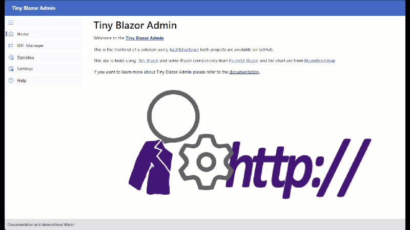

> **TL;DR:** Cet article détaille la migration d'un projet Blazor WebAssembly vers FluentUI Blazor Server, en soulignant les améliorations importantes en matière d'interface utilisateur, d'authentification et de conteneurisation avec Azure Container Apps et .NET Aspire.

## Pourquoi migrer?

La migration vers FluentUI Blazor Server a apporté trois avantages majeurs:
- 🎨 Interface utilisateur moderne avec les composants FluentUI
- 🔒 Authentification simplifiée grâce à Azure Container Apps
- 🚀 Meilleure expérience de développement avec .NET Aspire

Dans cet article, je partage mon expérience de migration d'un projet Blazor WebAssembly (WASM) vers un projet FluentUI Blazor Server. L'objectif était d'utiliser la nouvelle bibliothèque de composants FluentUI Blazor, de tirer parti de .NET Aspire et de pouvoir exécuter le projet dans un conteneur.

Récemment, j'ai travaillé sur la migration de [AzUrlShortener](https://github.com/microsoft/AzUrlShortener). J'ai mis à jour les SDK et les packages, amélioré la sécurité et modifié l'architecture de la solution. Cet article fait partie d'une série où je partage quelques détails intéressants, astuces et conseils que j'ai appris en travaillant sur ce projet.

[AzUrlShortener](https://github.com/microsoft/AzUrlShortener) est un projet Open source qui consiste en un raccourcisseur d'URL simple que j'ai construit il y a quelques années. L'objectif était simple: avoir une solution économique pour partager des URL courtes qui serait sécurisée, facile à utiliser et où les données resteraient les miennes. Chaque instance est hébergée dans Azure et comprend une API (Azure Function), un site Web Blazor WebAssembly (Azure Static Web App) et un stockage de données (Azure Storage Table).

Cet article fait partie d'une série sur la modernisation du projet AzUrlShortener:

- [Migration d'AzUrlShortener d'Azure SWA vers Azure Container Apps]([#](https://www.cloudenfrancais.com/posts/2025-04-22-urlshortener-architecture.html))
- Conversion de Blazor WASM vers FluentUI Blazor Server
- [Comment utiliser Azure Storage Table avec .NET Aspire et une API minimale](#) (soon)


## Stratégie de migration: Nouveau départ vs Refactorisation

Lors de la migration d'un projet existant, vous avez deux options: Modifier le projet existant pour le transformer en un nouveau type, ou créer un nouveau projet et copier-coller des morceaux de code de l'ancien projet vers le nouveau. Dans ce cas, j'ai choisi de créer un nouveau projet et de copier-coller le code. De cette façon, je pouvais garder l'ancien projet comme sauvegarde en cas de problème.

## Création d'un nouveau projet

Comme mentionné précédemment, je voulais utiliser la nouvelle librairie de composants [FluentUI Blazor](https://fluentui-blazor.net/). C'est un projet open-source qui fournit un ensemble de composants pour construire des applications web en utilisant le système de design FluentUI. Il facilite la création d'interfaces utilisateur belles et réactives qui sont cohérentes. Pour créer un nouveau projet, nous pouvons utiliser le modèle disponible.

```bash
dotnet new fluentblazor -n Cloud5mins.ShortenerTools.TinyBlazorAdmin
```

## Support du mode sombre et thèmes 🌙

Ce que je fais systématiquement pour tous mes projets FluentUI Blazor est d'ajouter une page de paramètres. Cette page permet à l'utilisateur de changer le thème et la couleur de l'application. Je devrais créer un modèle pour gagner du temps, mais en attendant, voici le code requis pour ajouter la page de paramètres.

### Settings.razor

Commençons par créer cette nouvelle page appelée Settings.razor. Avec deux sélecteurs, un pour le thème (sombre ou clair) et un pour la couleur d'accent.

```html
@page "/settings"

@using Microsoft.FluentUI.AspNetCore.Components.Extensions

@rendermode InteractiveServer

<FluentDesignTheme @bind-Mode="@Mode"
				   @bind-OfficeColor="@OfficeColor"
				   StorageName="theme" />

<h3>Paramètres</h3>

<div>
	<FluentStack Orientation="Orientation.Vertical">
		<FluentSelect   Label="Thème" Width="150px"
						Items="@(Enum.GetValues<DesignThemeModes>())"
						@bind-SelectedOption="@Mode" />
		<FluentSelect   Label="Couleur"
						Items="@(Enum.GetValues<OfficeColor>().Select(i => (OfficeColor?)i))"
			Height="200px" Width="250px" @bind-SelectedOption="@OfficeColor">
			<OptionTemplate>
				<FluentStack>
					<FluentIcon Value="@(new Icons.Filled.Size20.RectangleLandscape())" Color="Color.Custom"
						CustomColor="@(@context.ToAttributeValue() != "default" ? context.ToAttributeValue() : "#036ac4" )" />
					<FluentLabel>@context</FluentLabel>
				</FluentStack>
			</OptionTemplate>
		</FluentSelect>
	</FluentStack>
</div>

@code {
    public DesignThemeModes Mode { get; set; }
    public OfficeColor? OfficeColor { get; set; }
}
```

### App.razor

Dans l'application elle-même, nous devons ajouter du JavaScript et le composant de chargement du thème. Juste après la balise `</body>`, nous devons ajouter le code suivant:

```html
<!-- Définir le thème par défaut -->

<script src="_content/Microsoft.FluentUI.AspNetCore.Components/js/loading-theme.js" type="text/javascript"></script>

<loading-theme storage-name="theme"></loading-theme>
```

### _Imports_.razor

J'ai remarqué quelques avertissements dans le code concernant des directives using manquantes. Pour résoudre ce problème, trouvez la ligne qui fait référence à `Components.Icons` dans `_Imports.razor` et remplacez-la par ce qui suit. L'alias `Icons` devrait résoudre le problème.

```csharp
@using Icons = Microsoft.FluentUI.AspNetCore.Components.Icons
```

### MainLayout.razor

La mise en page principale est notre page de base par défaut. Nous devons ajouter `Mode` et `OfficeColor` pour les rendre accessibles à toute l'application.

```csharp
@code {
    public DesignThemeModes Mode { get; set; }
    public OfficeColor? OfficeColor { get; set; }
}
```

### NavMenu.razor

Il ne reste plus qu'à pouvoir accéder facilement à cette nouvelle page. Cela peut être fait simplement en ajoutant une option dans le menu de navigation.

```html
<FluentNavLink Href="/settings" Match="NavLinkMatch.All" Icon="@(new Icons.Regular.Size20.TextBulletListSquareSettings())">Paramètres</FluentNavLink>
```

### Testez-le

Et voilà! Vous devriez maintenant avoir une page de paramètres qui permet à l'utilisateur de changer le thème et la couleur de l'application. C'est tout à fait intéressant et ce n'est pas vraiment lié à la migration, mais c'est une belle amélioration. Le mode sombre pour la victoire!

## La migration

La migration elle-même comportait de nombreux petits morceaux, mais n'était pas si complexe. Le projet fait partie d'une solution .NET Aspire, j'ai donc ajouté le projet à la solution avec `dotnet sln add ./Cloud5mins.ShortenerTools.TinyBlazorAdmin`. Puis j'ai ajouté les références à `Cloud5mins.ShortenerTools.Core` (la bibliothèque de classes avec tous les modèles et services) et le projet `ServiceDefault` qui a été généré lors de l'ajout d'Aspire à la solution.

L'étape logique suivante était d'ajouter notre projet Blazor à l'orchestrateur avec ces lignes dans le `Program.cs` du projet `AppHost`.

```csharp
builder.AddProject<Projects.Cloud5mins_ShortenerTools_TinyBlazorAdmin>("admin")
	.WithExternalHttpEndpoints()
	.WithReference(manAPI);
```

Cela s'assurera que le projet TinyBlazorAdmin démarre avec une référence à l'API et dispose de points de terminaison accessibles. Sans le `.WithExternalHttpEndpoints()`, le projet ne serait pas accessible une fois déployé sur Azure.

Pour utiliser la capacité de .NET Aspire à orchestrer les différents projets, nous devons remplacer notre création précédente de `HttpClient` dans le `Program.cs` de TinyBlazorAdmin par le code suivant:

```csharp
builder.Services.AddHttpClient<UrlManagerClient>(client => 
{
    client.BaseAddress = new Uri("https+http://api");
});
```

Cela garantira que `UrlManagerClient` reçoit un httpClient utilisant l'adresse et le port corrects lors de l'appel à l'API. Examinons la classe `UrlManagerClient` et l'une des méthodes qui sera utilisée pour appeler l'API.

```csharp
public class UrlManagerClient(HttpClient httpClient)
{

	public async Task<IQueryable<ShortUrlEntity>?> GetUrls()
    {
		IQueryable<ShortUrlEntity> urlList = null;
		try{
			using var response = await httpClient.GetAsync("/api/UrlList");
			if(response.IsSuccessStatusCode){
				var urls = await response.Content.ReadFromJsonAsync<ListResponse>();
				urlList = urls!.UrlList.AsQueryable<ShortUrlEntity>();
			}
		}
		catch(Exception ex){
			Console.WriteLine(ex.Message);
		}
        
		return urlList;
    }
	// ...
}
```

Comme le montre le code, le `httpClient` est injecté dans le constructeur et utilisé pour appeler l'API. La méthode `GetUrls` est une simple requête GET qui renvoie une liste de `ShortUrlEntity`. L'API est celle créée dans un article précédent: [Comment utiliser Azure Storage Table avec .NET Aspire et une API minimale](#), et toutes les classes font partie du projet `Cloud5mins.ShortenerTools.Core`.

### La grille d'URL

Une partie de la migration consistait également à remplacer la grille Syncfusion par la nouvelle grille FluentUI Blazor. Non pas que les contrôles Syncfusion ne soient pas excellents, bien au contraire, mais comme le projet AzUrlShortener a été transféré à un autre propriétaire, je pense qu'il serait préférable d'utiliser des composants qui ne nécessitent pas de licences.

Pour cette première itération, la grille Syncfusion sera remplacée par la grille FluentUI Blazor. Dans une itération future, le composant Syncfusion Charts sera également remplacé. Merci à [Syncfusion](https://www.syncfusion.com/blazor-components) pour la licence communautaire utilisée dans ce projet.

Le code de `UrlManager.razor` a beaucoup changé car les deux grilles étaient un peu différentes dans leur nommage et leur utilisation. Le tri nécessitait un peu plus de code car le nom des colonnes n'est pas le même que le nom des propriétés. Pour fournir un exemple, la colonne "Vanity" est en fait la propriété `RowKey` de la classe `ShortUrlEntity`. Pour pouvoir trier la colonne, nous devons créer un objet `GridSort` qui sera utilisé dans la définition de la `TemplateColumn`.

Définition de la colonne dans la grille:

```html
<TemplateColumn Title="Vanity" Width="150px" Sortable="true" SortBy="@sortByVanities">
    <FluentAnchor Href="@context!.ShortUrl" Target="_blank" Aearance="Appearance.Hypeext">@context!.RowKey</FluentAnchor>
</TemplateColumn>
```

Définition de l'objet `GridSort`:

```csharp
GridSort<ShortUrlEntity> sortByVanities = GridSort<ShortUrlEntity>.ByAscending(p => p.RowKey);
```

Une grande amélioration qui pourrait être apportée à l'avenir serait d'utiliser la grille virtuelle. La grille virtuelle est un excellent moyen d'améliorer les performances de la grille lorsqu'on traite une grande quantité de données car elle ne charge que les données visibles à l'écran. J'ai montré comment utiliser la grille virtuelle dans un article précédent: [Comment utiliser un Blazor QuickGrid avec GraphQL](https://devblogs.microsoft.com/dotnet/how-use-a-blazor-quickgrid-with-graphql/).

### Suppression de la fausse div popup

L'un des composants de FluentUI Blazor est le `FluentUIDialogue`. Ce composant est utilisé pour afficher une fenêtre popup et nous aidera à garder le code plus structuré et propre. Au lieu d'avoir des `<div>` dans le code, nous pouvons taper `<FluentUIDialog>` et il sera rendu comme un popup.

```csharp
var dialog = await DialogService.ShowDialogAsync<NewUrlDialog>(shortUrlRequest, new DialogParameters()
	{
		Title = "Créer une nouvelle URL courte",
		PreventDismissOnOverlayClick = true,
		PreventScroll = true
	});
```



## Remplacement de l'authentification

Au lieu d'avoir à implémenter l'authentification dans le projet Blazor, nous utiliserons une fonctionnalité d'Azure Container Apps qui ne nécessite aucun changement de code! Vous n'avez pas besoin de changer une seule ligne de code pour sécuriser votre application déployée sur Azure Container Apps (ACA)! Au lieu de cela, votre application est automatiquement protégée simplement en activant la fonctionnalité d'authentification, appelée EasyAuth.

Une fois la solution déployée sur Azure, TinyBlazorAdmin sera installé dans une application conteneur nommée "admin". Pour la sécuriser, accédez au portail Azure et sélectionnez l'application conteneur que vous souhaitez sécuriser. Dans ce cas, ce sera l'application conteneur "admin". Dans le menu de gauche, sélectionnez Authentification et cliquez sur Ajouter un fournisseur d'identité.

Vous pouvez choisir entre plusieurs fournisseurs, mais utilisons Microsoft puisqu'il est déployé dans Azure et que vous êtes déjà connecté. Une fois Microsoft choisi, vous verrez de nombreuses options de configuration. Sélectionnez l'expiration recommandée du secret client (par exemple, 180 jours). Vous pouvez conserver tous les autres paramètres par défaut. Cliquez sur Ajouter. Après quelques secondes, vous devriez voir une notification dans le coin supérieur droit indiquant que le fournisseur d'identité a été ajouté avec succès.

Voilà! Votre application a maintenant l'authentification. La prochaine fois que vous naviguerez vers l'application, vous serez invité à vous connecter avec votre compte Microsoft. Remarquez que toute votre application est protégée. Aucune page n'est accessible sans authentification.

## Conclusion

La migration de Blazor WebAssembly vers FluentUI Blazor Server a été un voyage réussi qui a apporté plusieurs améliorations significatives au projet:

- Interface utilisateur améliorée avec des composants FluentUI modernes
- Structure de code plus propre et maintenable
- Authentification simplifiée grâce à EasyAuth d'Azure Container Apps
- Meilleure expérience de développement local avec l'orchestration .NET Aspire

Le résultat final est une application moderne et conteneurisée qui est à la fois plus facile à maintenir et plus agréable à utiliser. L'ajout du support du mode sombre et des capacités de thèmes sont de grandes améliorations pour l'expérience utilisateur.

## Vous voulez en apprendre davantage?

Pour en apprendre davantage sur Azure Container Apps, je vous conseille fortement ce dépôt: [Débuter avec .NET sur Azure Container Apps](https://github.com/FBoucher/getting-started-dotnet-aca). Il contient plusieurs tutoriels étape par étape (avec vidéos) pour apprendre à utiliser Azure Container Apps avec .NET.

Vous avez des questions sur le processus de migration ou vous souhaitez partager vos propres expériences avec FluentUI Blazor? N'hésitez pas à me contacter sur [@fboucheros.bsky.social](https://bsky.app/profile/fboucheros.bsky.social) ou à ouvrir un problème sur le [dépôt GitHub AzUrlShortener](https://github.com/microsoft/AzUrlShortener). J'aimerais connaître vos réflexions!

## Références

- [Documentation FluentUI Blazor](https://fluentui-blazor.net/)
- [Authentification et autorisation d'Azure Container Apps](https://learn.microsoft.com/fr-ca/azure/container-apps/authentication)
- [Documentation .NET Aspire](https://learn.microsoft.com/fr-ca/dotnet/aspire/get-started/overview)
- [Dépôt GitHub AzUrlShortener](https://github.com/microsoft/AzUrlShortener)