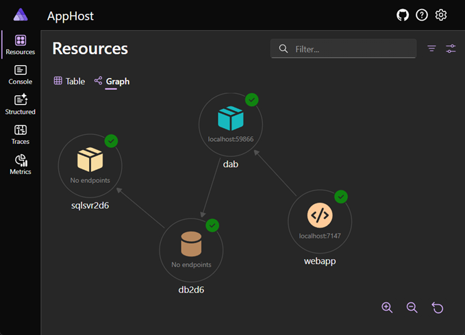
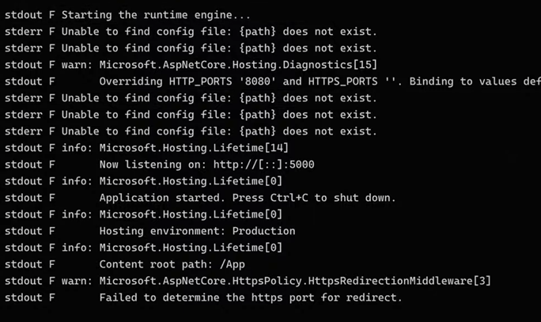
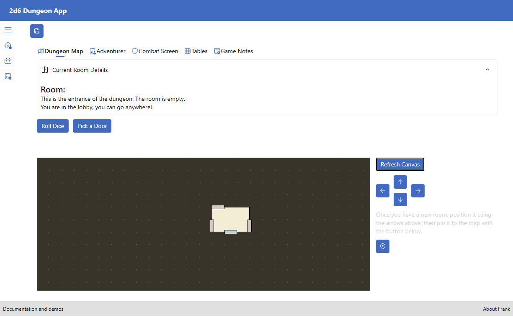

L'automatisation des déploiements est quelque chose que j'apprécie toujours. Cependant, c'est vrai que cela prend souvent plus de temps qu'un simple "déploiement par clic droit". De plus, vous devez peut-être connaître différentes technologies et langages de script.

Mais que diriez-vous s'il existait un outil qui pourrait vous aider à écrire tout ce dont vous avez besoin — les fichiers d'Infrastructure as Code (IaC), les scripts pour copier les fichiers et les scripts pour peupler une base de données ? Dans cet article, nous explorerons comment le **CLI Azure Developer (azd)** peut grandement simplifier les déploiements.


## Que voulons-nous faire ?

Notre objectif : **Déployer l'[application 2D6 Dungeon](https://c5m.ca/2d6-dungeon-app) vers Azure Container Apps.**

Cette solution .NET Aspire comprend :
- Une interface utilisateur (frontend)
- Une API de données
- Une base de données




## Le Problème

Dans un [article précédent](https://devblogs.microsoft.com/azure-sdk/azure-developer-cli-azd-in-a-real-life-scenario/), nous avons montré comment `azd up` peut facilement déployer des applications web vers Azure.

Si nous essayons la même commande pour cette solution, le déploiement sera réussi, mais incomplet :
- L'interface Blazor .NET est déployée parfaitement.
- **Cependant, l'application échoue lors de l'accès aux données.**
- En examinant les journaux, nous constatons que la base de données n'a pas été créée ni peuplée, et le conteneur API ne démarre pas.

Examinons ces problèmes de plus près.


### La Base de Données

Lors de l'exécution locale de la solution, Aspire crée un conteneur MySQL et exécute des scripts SQL pour créer et peupler les tables. Ceci est spécifié dans le projet AppHost :

```csharp
var mysql = builder.AddMySql("sqlsvr2d6")
                   .WithLifetime(ContainerLifetime.Persistent);
                
var db2d6 = mysql.AddDatabase("db2d6");

mysql.WithInitBindMount(source: "../../database/scripts", isReadOnly: false);
```

Lorsque MySQL démarre, il cherche des fichiers SQL dans un dossier spécifique et les exécute. **Localement, cela fonctionne car le montage est mappé à un dossier local contenant les fichiers.**

**Cependant, une fois déployé sur Azure :**
- Les montages sont créés dans Azure Storage Files
- **Les fichiers sont manquants !**


### L'API de Données

Ce projet utilise **[Data API Builder (dab)](https://c5m.ca/dab)**. Basé sur un seul fichier de configuration, une API de données complète est construite et hébergée dans un conteneur.

Localement, Aspire crée un conteneur DAB et lit le fichier de configuration JSON pour créer l'API. Ceci est spécifié dans le projet AppHost :

```csharp
var dab = builder.AddDataAPIBuilder("dab", ["../../database/dab-config.json"])
                .WithReference(db2d6)
                .WaitFor(db2d6);
```
Mais encore une fois, une fois déployé sur Azure, le fichier est manquant. Le conteneur DAB démarre mais ne trouve pas le fichier de configuration.




## La Solution

La solution est simple : **les scripts SQL et le fichier de configuration DAB doivent être téléversés dans Azure Storage Files pendant le déploiement.**

Vous pouvez le faire en ajoutant un **hook post-provision** dans le fichier `azure.yaml` pour exécuter un script qui téléverse les fichiers. Voir un exemple de hook post-provision dans [cet article](https://devblogs.microsoft.com/dotnet/generate-dotnet-secrets-automatically-from-azure-deployment/).

Alternativement, vous pouvez utiliser les fonctionnalités alpha d'azd : `azd.operations` et `infraSynth`.
- `azd.operations` étend les fournisseurs de provisionnement et téléversera les fichiers pour nous.
- `infraSynth` génère les fichiers IaC pour la solution complète.

> **💡Note :** Ces fonctionnalités sont en alpha et sujettes à changement.

Chaque fonctionnalité alpha d'azd peut être activée individuellement. Pour voir toutes les fonctionnalités :

```bash
azd config list-alpha
```

Pour activer les fonctionnalités dont nous avons besoin :

```bash
azd config set alpha.azd.operations on
azd config set alpha.infraSynth on
```


## Essayons-le

Une fois la fonctionnalité `azd.operation` activée, chaque `azd up` téléversera maintenant les fichiers dans Azure. Si vous vérifiez la base de données, vous verrez que la base de données `db2d6` a été créée et peuplée. **Youpi !**

Cependant, l'API DAB échouera encore au démarrage. Pourquoi ? Parce qu'actuellement, DAB cherche un fichier, pas un dossier, au démarrage. Cela peut être corrigé en modifiant les fichiers IaC.


## Une Dernière Étape : Synthétiser les Fichiers IaC

D'abord, synthétisons les fichiers IaC. Ces fichiers Bicep décrivent l'infrastructure requise pour notre solution.

Avec la fonctionnalité `infraSynth` activée, exécutez :

```bash
azd infra synth
```

Vous verrez maintenant un nouveau dossier `infra` sous le projet AppHost, avec des fichiers YAML correspondant aux noms des conteneurs. Chaque fichier contient les détails pour créer un conteneur.

Ouvrez le fichier `dab.tmpl.yaml` pour voir la configuration de l'API DAB. Cherchez la section `volumeMounts`. Pour aider DAB à trouver son fichier de configuration, **ajoutez `subPath: dab-config.json` pour rendre la liaison plus spécifique :**

```yaml
containers:
    - image: {{ .Image }}
      name: dab
      env:
        - name: AZURE_CLIENT_ID
          value: {{ .Env.MANAGED_IDENTITY_CLIENT_ID }}
        - name: ConnectionStrings__db2d6
          secretRef: connectionstrings--db2d6
      volumeMounts:
        - volumeName: dab-bm0
          mountPath: /App/dab-config.json
          subPath: dab-config.json
scale:
    minReplicas: 1
    maxReplicas: 1
```

Vous pouvez également spécifier le nombre minimum et maximum de réplicas pour la mise à l'échelle si vous le souhaitez.

Maintenant que les fichiers IaC sont créés, azd les utilisera. Si vous exécutez `azd up` à nouveau, le temps d'exécution sera beaucoup plus rapide — **le déploiement azd est incrémentiel et ne fait que "ce qui a changé".**


## Le Résultat Final

La solution est maintenant entièrement déployée :
- La base de données est là avec les données
- L'API fonctionne comme prévu
- Vous pouvez utiliser votre application !



### Bonus : Déploiement avec CI/CD

Vous voulez déployer avec CI/CD ? D'abord, générez le workflow GitHub Action (ou Azure DevOps) avec :

```bash
azd pipeline config
```

Ensuite, ajoutez une étape pour activer la fonctionnalité alpha avant l'étape de provisionnement dans le fichier `azure-dev.yml` généré par la commande précédente:

```yaml
- name: Étendre les fournisseurs de provisionnement avec les opérations azd
  run: azd config set alpha.azd.operations on     
```

Avec ces modifications, et en supposant que les fichiers d'infrastructure sont inclus dans le dépôt, le déploiement fonctionnera du premier coup.


## Conclusion

C'est passionnant de voir comment des outils comme azd façonnent l'avenir du développement et du déploiement. Non seulement ils facilitent la vie des développeurs aujourd'hui en automatisant des tâches complexes, mais ils s'assurent également que vous êtes prêt pour la production avec tous les fichiers d'Infrastructure as Code (IaC) nécessaires en place. Le voyage du code vers le cloud n'a jamais été aussi fluide !

Si vous avez des questions ou des commentaires, je suis toujours heureux d'aider — contactez-moi simplement sur votre plateforme de médias sociaux préférée.


## Version vidéo

J'ai également enregistré une vidéo, en anglais, pour illustrer tout cela. 

<iframe width="560" height="315" src="https://www.youtube.com/embed/0ZjYQdwcifs?si=nF0h_GcSkymaXuAB" title="YouTube video player" frameborder="0" allow="accelerometer; autoplay; clipboard-write; encrypted-media; gyroscope; picture-in-picture; web-share" referrerpolicy="strict-origin-when-cross-origin" allowfullscreen></iframe>


#### Références

- [Dépôt GitHub de 2D6 Dungeon App](https://c5m.ca/2d6-dungeon-app)
- [Azure Developer CLI (azd)](https://c5m.ca/azd)
- [Data API Builder (dab)](https://c5m.ca/dab)
