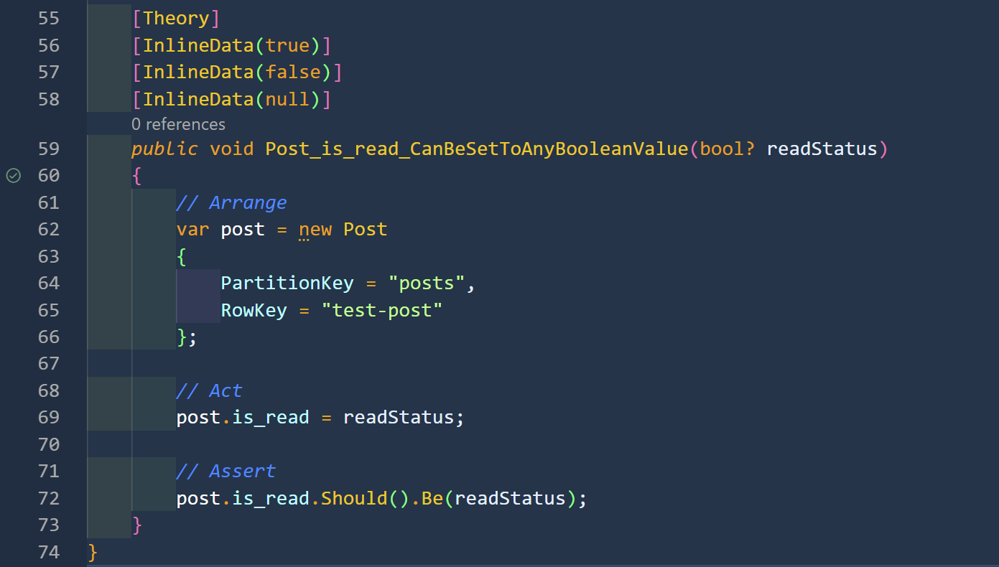
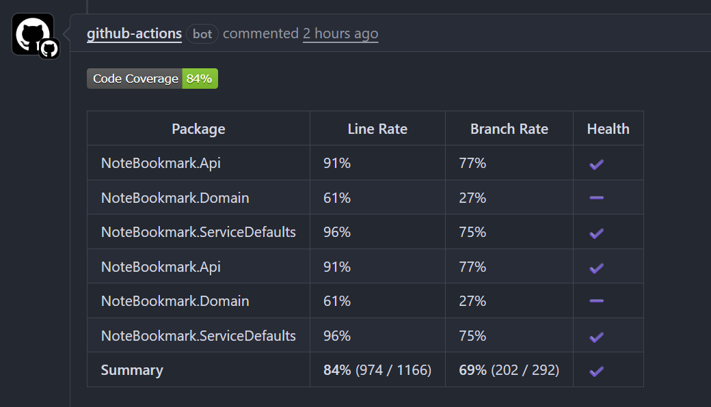
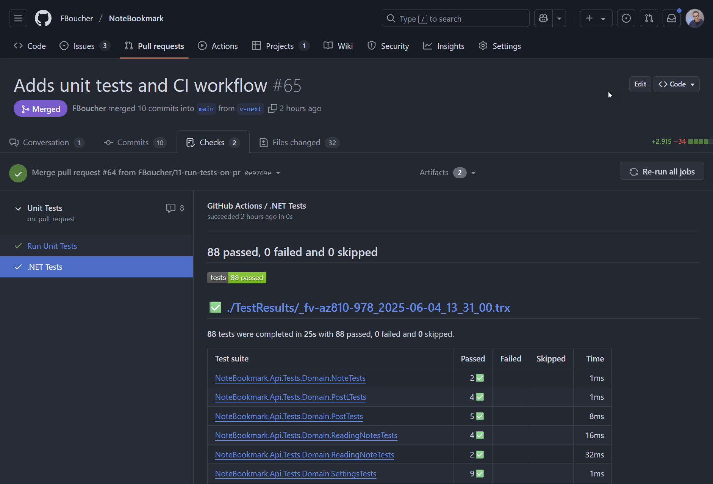
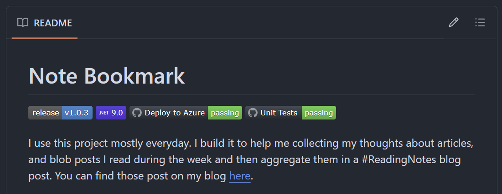

# J'ai co-écrit 88 tests unitaires avec l'IA : Le parcours d'un développeur

## Introduction

Les tests ont toujours été l'une de ces tâches que les développeurs savent essentielles, mais trouvent souvent ennuyeuses. Quand j'ai décidé d'ajouter des tests unitaires complets à mon projet [NoteBookmark](https://github.com/FBoucher/NoteBookmark), je me suis dit : pourquoi ne pas en faire une expérience de développement assisté par IA ? Ce qui a suivi fut un parcours fascinant de 4 heures qui a donné lieu à 88 tests unitaires, un pipeline CI/CD complet, et quelques insights précieux sur le travail avec les assistants de codage IA.

## Le projet : NoteBookmark

NoteBookmark est une application .NET construite avec C# qui aide les utilisateurs à gérer et organiser leurs notes de lecture et signets. Le projet inclut une API, un frontend Blazor, et utilise les services Azure pour le stockage. Vous pouvez consulter le projet complet sur [GitHub](https://github.com/FBoucher/NoteBookmark).

## Le défi : Partir de zéro

Je vais être honnête - ça faisait un bout que je n'avais pas écrit de tests unitaires complets. Plutôt que de me lancer moi-même, j'ai décidé de voir comment différents modèles d'IA aborderaient cette tâche. Ma demande initiale était délibérément vague : « ajouter un projet de test » sans autres spécifications.

En rétrospective, je réalise que j'aurais dû être plus spécifique sur quelles parties du code je voulais couvrir. Cela aurait rendu le processus de révision plus facile et m'aurait donné un meilleur contrôle sur la portée. Mais parfois, le meilleur apprentissage vient du fait de laisser l'IA nous surprendre.

## La grande comparaison des modèles d'IA

### GPT-4.1 : Compétent mais discret
GPT-4.1 a livré des résultats décents, mais l'expérience s'est sentie quelque peu mécanique. Le code qu'il a généré était fonctionnel, mais je me trouvais à vouloir plus de contexte. Les explications étaient minimales, et je devais souvent poser des questions de suivi pour comprendre le raisonnement derrière certaines approches de test.

### Gemini : Le faux départ
Mon expérience avec Gemini était... étrange. Peut-être était-ce un problème technique ou une mauvaise journée, mais la plupart de ce qui a été généré ne fonctionnait tout simplement pas. Je n'ai pas persisté longtemps avec ce modèle, car déboguer du code généré par IA qui ne fonctionne pas fondamentalement va à l'encontre du but de l'exercice. Notez qu'au moment d'écrire ces lignes, Gemini était encore en aperçu, donc je m'attends à ce qu'il s'améliore avec le temps.

### Claude Sonnet : Le grand gagnant
C'est là que la magie s'est produite. Claude Sonnet est devenu mon copilote de choix pour ce projet. Ce qui l'a distingué n'était pas seulement la qualité du code (même si elle était excellente), mais la qualité de la conversation. C'était comme avoir un collègue réfléchi qui pensait à voix haute avec moi.

Les explications étaient claires et éducatives. Quand Claude suggérait une approche de test particulière, il expliquait pourquoi. Quand il rencontrait un scénario complexe, il détaillait son raisonnement. J'ai essayé différentes versions de Claude Sonnet, mais n'ai pas remarqué de différences significatives dans les résultats - elles étaient toutes systématiquement bonnes.

## Le processus de développement : Un parcours de 4 heures

### Heures 1-2 : Arriver à la compilation
La première itération ne pouvait pas compiler. Ce n'était pas surprenant, étant donné la complexité de la base de code et la demande initiale vague. Mais c'est là que la collaboration IA a vraiment brillé. Au lieu de déboguer tout manuellement moi-même, j'ai travaillé avec Copilot pour identifier et corriger les problèmes de manière itérative.

Nous avons passé par plusieurs rondes de :
1. Identifier les erreurs de compilation
2. Discuter de la meilleure approche pour les corriger
3. Laisser l'IA implémenter les corrections
4. Réviser et raffiner

Après environ 2 heures, nous avions un projet de test avec 88 tests unitaires qui compilait avec succès. L'IA avait choisi xUnit comme framework de test, ce qui me convenait - c'est un choix solide que je n'aurais peut-être pas fait moi-même si j'étais rouillé sur le paysage actuel des tests .NET.

### Heures 2,5-3,5 : Faire passer les tests
Faire compiler les tests était une chose ; les faire passer était un tout autre défi. Cette phase m'a beaucoup appris sur ma base de code et les fonctionnalités xUnit que je ne connaissais pas.

Je me suis beaucoup appuyé sur la fonctionnalité `/explain` durant cette phase. Quand les tests échouaient, je demandais à Claude d'expliquer ce qui se passait et pourquoi. C'était inestimable pour comprendre non seulement la correction immédiate, mais les concepts de test sous-jacents.

Un de ces moments fut l'apprentissage de `[InlineData(true)]` et d'autres attributs de données xUnit. Ce n'étaient pas des fonctionnalités que je connaissais, et les avoir expliquées en contexte les a rendues immédiatement utiles.

### Heures 3,5-4 : Structure et style
Une fois que tous les tests passaient, j'ai passé du temps à m'assurer de comprendre chaque test et demander des changements structuraux pour correspondre à mes préférences. Cette phase était cruciale pour prendre possession du code. Ce n'est pas parce que l'IA l'a écrit qu'il devrait rester une boîte noire. Répétons ceci : **Comprendre le code est essentiel ; ce n'est pas parce que l'IA l'a écrit que c'est bon**.

## Au-delà des tests : Intégration CI/CD

Avec les tests terminés, j'ai demandé à Copilot de créer un workflow GitHub Actions pour exécuter les tests à chaque push vers les branches main et v-next, plus les révisions de PR. Au début, il a commencé à modifier mon workflow existant qui s'occupe du déploiement Azure. Je voulais un workflow séparé pour les tests, alors j'ai interrompu (c'est bien que je n'étais pas « forcé » d'attendre), et lui ai demandé d'en créer un nouveau à la place. Le résultat fut le workflow `running-unit-tests.yml` qui a fonctionné parfaitement du premier coup.

C'était vraiment surprenant. Les configurations CI/CD nécessitent souvent des ajustements, mais le workflow généré gérait :
- Configuration .NET multi-version
- Restauration des dépendances
- Construction et tests
- Rapport des résultats de test
- Analyse de couverture de code
- Téléchargement d'artefacts

## L'aventure d'amélioration des PR

C'est là que les choses sont devenues intéressantes. Quand j'ai demandé à Copilot d'améliorer le workflow pour montrer les résultats de test dans les PR, il a commencé à ajouter des composants, puis s'est arrêté et a demandé s'il pouvait supprimer la version actuelle et repartir de zéro.

J'ai dit oui, et je suis content de l'avoir fait. La version reconstruite a créé de beaux commentaires de PR montrant :
- Résumé des résultats de test
- Rapports de couverture de code (que je n'avais pas demandés, mais que j'ai appréciés)
- Ventilations détaillées.

## Les touches finales

Aucun projet n'est complet sans indicateurs de statut appropriés. J'ai ajouté un badge de statut de test au README, donnant à quiconque visite le dépôt une visibilité immédiate sur la santé du projet.

## Points clés à retenir

### Ce qui a bien fonctionné
1. **L'IA comme partenaire d'apprentissage** : Avoir Copilot qui explique les concepts de test et les fonctionnalités xUnit était comme avoir un professeur patient
2. **Raffinement itératif** : Le processus d'aller-retour s'est senti naturel et productif
3. **Solutions complètes** : L'IA n'a pas seulement écrit des tests ; elle a créé une infrastructure de test complète
4. **Qualité plutôt que vitesse** : Bien que cela ait pris 4 heures, le résultat était complet et bien structuré

### Ce que je ferais différemment
1. **Être plus spécifique initialement** : commencer avec une portée plus claire aurait rationalisé le processus
2. **Définir les priorités de test** : identifier d'abord les chemins critiques aurait été précieux
3. **Planifier les rapports de test visuels** : penser à la visualisation des résultats de test dès le début

### Leçons sur la collaboration IA
- **Le choix de modèle compte** : la différence entre les modèles d'IA était significative
- **La qualité de conversation compte** : des explications claires rendent la collaboration plus précieuse
- **Faire confiance, mais vérifier** : comprendre chaque morceau de code généré est crucial
- **Embrasser l'itération** : les meilleurs résultats viennent de multiples cycles de raffinement

## La vue d'ensemble

Cette expérience a renforcé ma conviction que les assistants de codage IA sont plus puissants quand ils sont de vrais collaborateurs plutôt que des générateurs de code. La valeur n'était pas seulement dans les 88 tests qui ont été écrits, mais dans l'apprentissage qui s'est passé en cours de route.

Pour les développeurs hésitants sur l'assistance IA dans les tests : il ne s'agit pas de remplacer vos compétences de test, mais de les augmenter. L'IA gère le code standard et suggère des patrons, mais vous apportez la connaissance du domaine et le jugement de qualité.

## Conclusion

Est-ce que je referais cela ? Absolument. La combinaison de couverture de test complète, d'opportunités d'apprentissage, et d'efficacité temporelle en a fait une victoire claire. Les 4 heures investies ont créé non seulement des tests, mais une infrastructure de test complète qui rapportera des dividendes tout au long du cycle de vie du projet.

Si vous considérez les tests assistés par IA pour vos propres projets, mon conseil est simple : commencez la conversation, préparez-vous à itérer, et n'ayez pas peur de demander « pourquoi » à chaque étape. Le but n'est pas seulement du code qui fonctionne - c'est de comprendre et posséder ce code.

La suite de tests complète et le pipeline CI/CD sont disponibles dans le [dépôt NoteBookmark](https://github.com/FBoucher/NoteBookmark) si vous voulez voir les résultats de cette collaboration IA en action.

