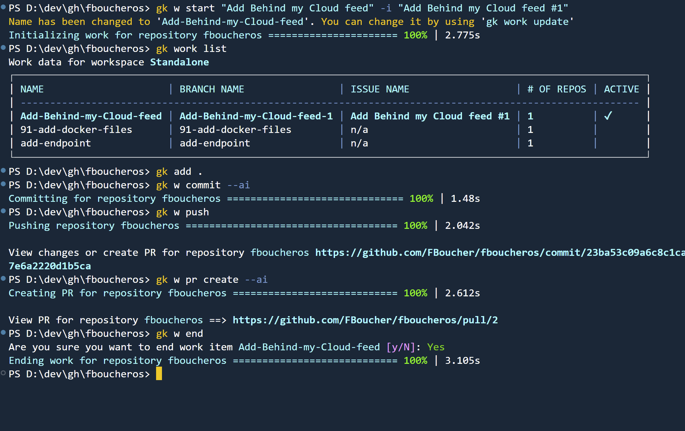

En tant que développeurs, nous cherchons constamment des outils qui peuvent nous aider à rester dans le flux et à être plus productifs. Aujourd'hui, je veux partager un outil puissant qui gagne en popularité dans la communauté des développeurs: **GitKraken CLI**. Cette interface en ligne de commande rassemble plusieurs fonctionnalités clés que les développeurs modernes adorent - elle est alimentée par l'IA, basée sur le terminal, et incroyablement efficace pour gérer les flux de travail Git.

## Ce qui rend GitKraken CLI spécial

GitKraken CLI (accessible via la commande `gk`) se démarque parce qu'elle simplifie les flux de travail Git complexes tout en ajoutant une automatisation intelligente. Contrairement aux commandes Git traditionnelles, elle fournit un système de gestion de flux de travail plus intuitif qui peut gérer plusieurs dépôts simultanément.

## Pour commencer

L'installation est simple. Sur Windows, vous pouvez l'installer en utilisant :

```powershell
winget install gitkraken.cli
```

Une fois installé, vous aurez accès à la commande `gk`, qui devient votre passerelle vers des opérations Git rationalisées.

## Le flux de travail en action

Passons en revue une session de développement typique en utilisant GitKraken CLI :

### 1. Démarrer une session de travail

Au lieu de créer manuellement des branches et de changer de contexte, vous pouvez démarrer une session de travail focalisée :

```bash
gk w start "Add Behind my Cloud feed" -i "Add Behind my Cloud feed #1"
```

Cette commande unique :
- Crée une nouvelle branche basée sur le nom de votre problème/fonctionnalité
- Bascule vers cette branche automatiquement
- Lie la session de travail à un problème spécifique
- Configure votre environnement de développement pour un travail focalisé

### 2. Gérer plusieurs sessions de travail

Vous pouvez facilement voir toutes vos sessions de travail actives :

```bash
gk w list
```

C'est particulièrement puissant quand vous travaillez sur plusieurs dépôts ou jonglez avec plusieurs fonctionnalités simultanément.

### 3. Faire des commits avec intelligence

Après avoir fait vos modifications, ajouter des fichiers fonctionne comme prévu :

```bash
gk add .
```

Mais c'est ici que la magie de l'IA opère. Au lieu d'écrire des messages de commit manuellement :

```bash
gk w commit --ai
```

L'IA analyse vos modifications et génère automatiquement des messages de commit significatifs et descriptifs. Fini les commits "quick fix" ou "update stuff" !

### 4. Pousser et créer des demandes de tirage

Publier votre travail est tout aussi rationalisé :

```bash
gk w push
```

Et quand vous êtes prêt à créer une demande de tirage :

```bash
gk w pr create --ai
```

Encore une fois, l'assistance de l'IA aide à générer des titres et descriptions de PR appropriés basés sur votre travail.

### 5. Finaliser

Une fois votre travail terminé et fusionné, le nettoyage est simple :

```bash
gk w end
```

Cette commande :
- Vous ramène sur la branche principale
- Supprime la branche de fonctionnalité, localement et sur GitHub
- Ferme la session de travail
- Laisse votre dépôt propre et prêt pour la prochaine tâche



## Pourquoi c'est important

La beauté de GitKraken CLI réside dans sa capacité à vous garder dans la zone. Vous n'avez pas besoin de :
- Basculer entre plusieurs outils
- Mémoriser des commandes Git complexes
- Écrire des messages de commit à partir de zéro
- Gérer manuellement le cycle de vie des branches

Tout s'enchaîne naturellement d'une commande à l'autre, maintenant votre focus sur ce qui compte le plus : écrire du code.

## Puissance multi-dépôts

Une des fonctionnalités remarquables est la capacité de GitKraken CLI à gérer plusieurs dépôts simultanément. C'est inestimable pour :
- Les architectures de microservices
- Les applications full-stack avec des dépôts frontend/backend séparés
- Les organisations avec plusieurs projets liés


## Essayez-le vous-même

GitKraken CLI fait partie d'une suite plus large d'outils de développement que GitKraken offre. La CLI elle-même est gratuite à utiliser, ce qui facilite l'expérimentation et l'intégration dans votre flux de travail sans engagement initial. Si vous trouvez de la valeur dans la CLI et voulez explorer leurs autres outils, GitKraken a divers produits qui pourraient compléter votre configuration de développement.

La courbe d'apprentissage est vraiment minimale puisqu'elle s'appuie sur les concepts Git que vous connaissez déjà tout en ajoutant une automatisation utile. J'ai trouvé que même de petites améliorations de flux de travail peuvent s'accumuler avec le temps, surtout quand vous travaillez sur plusieurs projets ou faites face à des changements de contexte fréquents.

Si vous êtes curieux de ce que GitKraken offre au-delà de la CLI, vous pouvez [explorer leur gamme complète de produits ici](https://c5m.ca/gitkraken). Pour ceux qui décident que les fonctionnalités Pro bénéficieraient à leur flux de travail, en tant qu'ambassadeur de GitKraken je peux partager mon code pour fournir [une réduction de 50%](https://c5m.ca/krakenpro) pour votre abonnement GitKraken Pro.

La combinaison de l'assistance IA et des commandes intuitives adresse de vrais points de douleur que beaucoup de développeurs affrontent quotidiennement. Que GitKraken CLI devienne une partie centrale de votre boîte à outils dépendra de votre flux de travail spécifique, mais ça vaut la peine d'essayer étant donné que c'est gratuit et ne prend que quelques minutes à configurer.

## Version vidéo

J'ai également enregistré une vidéo, en anglais, pour illustrer tout cela. 

<iframe width="560" height="315" src="https://www.youtube.com/embed/T0tJGkparig?si=wl0HTUP--78f5g3V" title="YouTube video player" frameborder="0" allow="accelerometer; autoplay; clipboard-write; encrypted-media; gyroscope; picture-in-picture; web-share" referrerpolicy="strict-origin-when-cross-origin" allowfullscreen></iframe>

---

*Les meilleurs outils sont ceux qui s'effacent et vous laissent vous concentrer sur la construction. GitKraken CLI vise à faire exactement cela.*