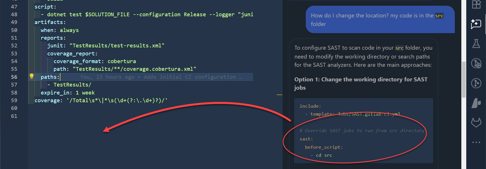
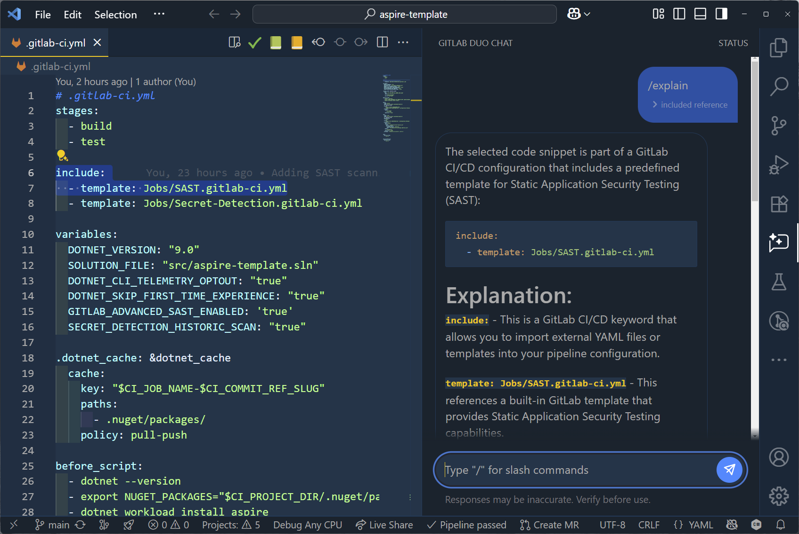
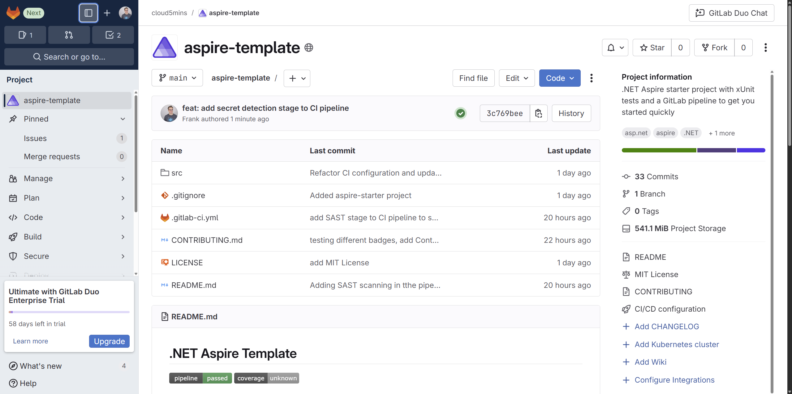

Obtenir un pipeline CI/CD complet pour votre solution .NET Aspire n'a pas besoin d'être compliqué. J'ai créé un template qui vous donne tout ce dont vous avez besoin pour commencer en quelques minutes.

## Partie 1 : Le template prêt à utiliser

J'ai créé un template .NET Aspire qui vient avec tout configuré et prêt à utiliser. Voici ce que vous obtenez :

### Ce qui est inclus
- Un projet .NET Aspire Starter classique (API et frontend)
- Tests unitaires utilisant xUnit (facilement adaptable à d'autres frameworks de test)
- Configuration complète du pipeline `.gitlab-ci.yml`
- Analyse de sécurité et détection de secrets
- Toute la documentation dont vous avez besoin

### Ce que fait le pipeline
Le pipeline exécute deux jobs principaux automatiquement :

1. **Build** : Compile votre code
2. **Test** : Exécute tous les tests unitaires, analyse les vulnérabilités, et vérifie les secrets accidentellement committés (clés API, mots de passe, etc.)

Vous pouvez voir tous les résultats de tests directement dans l'interface de GitLab, ce qui facilite le suivi de la santé de votre projet.

### Comment commencer

C'est simple :

1. Clonez le repository template : [cloud5mins/aspire-template](https://gitlab.com/cloud5mins/aspire-template)
2. Remplacez le projet exemple avec votre propre code .NET Aspire
3. Poussez vers votre repository GitLab
4. Regardez votre pipeline CI/CD s'exécuter automatiquement

C'est tout ! Vous obtenez immédiatement des builds automatisés, des tests, et de l'analyse de sécurité.

> **Conseil de pro** : Le meilleur moment pour configurer le CI/CD c'est quand vous commencez tout juste votre projet parce que tout est encore simple.

## Partie 2 : Construire le template avec GitLab Duo

Maintenant laissez-moi partager mon expérience de création de ce template en utilisant l'assistant IA de GitLab, [GitLab Duo](https://about.gitlab.com/gitlab-duo/).

### Commencer simple, grandir intelligemment

Je n'ai pas construit ce pipeline complexe d'un coup. J'ai commencé avec quelque chose de très basique et j'ai utilisé GitLab Duo pour graduellement ajouter des fonctionnalités. L'IA m'a aidé à :

- Ajouter la détection de secrets quand j'ai demandé : "Comment puis-je analyser les secrets accidentellement committés ?"
- Corriger les problèmes d'exécution de tests quand mes tests unitaires ne roulaient pas correctement
- Optimiser la structure du pipeline pour une meilleure performance

### Travailler avec GitLab dans VS Code

Bien que vous puissiez éditer les fichiers `.gitlab-ci.yml` directement dans l'interface web de GitLab, je préfère VS Code. Voici ma configuration :

1. Installez l'extension officielle **GitLab** du marketplace VS Code

Une fois connecté, cette extension vous donne :
- Accès direct aux issues GitLab et items de travail
- Chat alimenté par l'IA avec GitLab Duo

### GitLab Duo en action

GitLab Duo est devenu mon partenaire de programmation en paire. Voici comment je l'ai utilisé :

**Comprendre le code** : Je pouvais taper `/explain` et demander à Duo d'expliquer ce que n'importe quelle partie de ma configuration de pipeline fait en surlignant cette section.

**Résoudre des problèmes** : Quand la solution ne compilait pas, j'ai décrit le problème à Duo et j'ai obtenu des suggestions spécifiques. Par exemple, ça m'a aidé à réaliser que certains projets n'étaient pas en .NET 9 parce que dotnet build nécessitait la charge de travail Aspire. Je pouvais soit garder mon projet en .NET 8 et ajouter une instruction before_script pour installer la charge de travail, soit faire la mise à niveau vers .NET 9; j'ai choisi la dernière option.

**Ajouter des fonctionnalités** : J'ai commencé avec juste build et test, puis j'ai demandé de façon incrémentale à Duo de m'aider à ajouter l'analyse de sécurité, la détection de secrets, et une meilleure gestion d'erreurs.

**Ajouter du contexte** : Utiliser `/include` pour ajouter le fichier projet ou le fichier `.gitlab-ci.yml` en posant des questions a aidé Duo à mieux comprendre le contexte.

**Apprendre plus avec la doc** : Durant mon parcours, je savais que Duo n'inventait pas des affaires puisqu'il référençait la documentation. Je pouvais continuer mon apprentissage là-bas et lire plus d'exemples de comment `before_script` est utilisé dans différents contextes.

### L'expérience de développement assistée par IA

Ce qui m'a le plus impressionné c'est comment GitLab Duo m'a aidé à apprendre en construisant. Au lieu de juste copier des configurations de la documentation, chaque conversation m'a appris quelque chose de nouveau sur les meilleures pratiques GitLab CI/CD.

## Regardez la vidéo (en anglais) 

<iframe width="560" height="315" src="https://www.youtube.com/embed/COWLi_OxOh4?si=29I5wD_FoQ4e2MCy" title="YouTube video player" frameborder="0" allow="accelerometer; autoplay; clipboard-write; encrypted-media; gyroscope; picture-in-picture; web-share" referrerpolicy="strict-origin-when-cross-origin" allowfullscreen></iframe>

## Conclusion

Je pense que ce template peut être utile pour quiconque commence un projet .NET Aspire. Prêt à l'essayer ? Clonez le template à [cloud5mins/aspire-template](https://gitlab.com/cloud5mins/aspire-template) et commencez à construire en toute confiance.

Que vous soyez nouveau à .NET Aspire ou au CI/CD, ce template vous donne une bonne fondation. Et si vous voulez le personnaliser davantage, GitLab Duo est là pour vous aider à comprendre et modifier la configuration.

Si vous pensez qu'on devrait ajouter plus de fonctionnalités ou améliorer le template, n'hésitez pas à ouvrir une issue dans le repository. Vos commentaires sont toujours les bienvenus !

Merci à [David Fowler](https://bsky.app/profile/davidfowl.com/post/3ltiwbulr222r) pour son feedback!