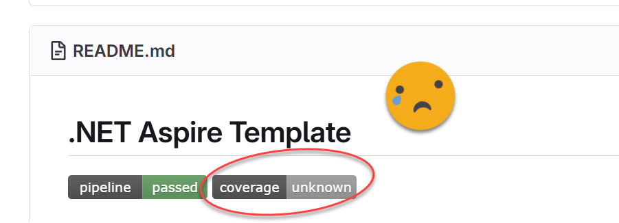
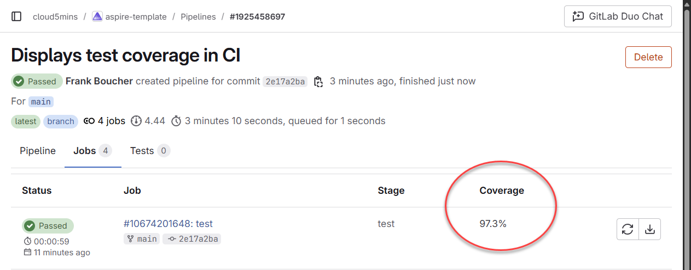
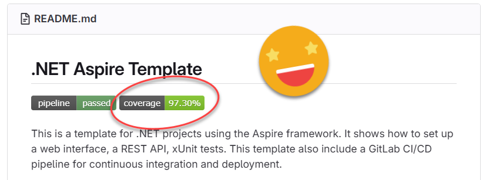

Dans un récent [blog post](https://www.cloudenfrancais.com/posts/2025-07-07-comment-avoir-un-cicd-pour-aspire-sur-gitlab.html), j'ai partagé comment configurer un pipeline CI/CD pour un projet .NET Aspire sur GitLab. Le pipeline inclut des tests unitaires, une analyse de sécurité, et la détection de secrets, et si l'un de ces éléments échoue, le pipeline échouerait. Super, mais qu'en est-il de la couverture de code (Code Coverage) pour les tests unitaires ? Le pipeline incluait des commandes de couverture de code, mais la couverture n'était pas visible dans l'interface GitLab. Réglons ça.



## Le problème

Une chose que j'ai d'abord pensé c'est que le regex utilisé pour extraire la couverture était incorrect. Le regex utilisé dans le pipeline était:

```yaml
coverage: '/Total\s*\|\s*(\d+(?:\.\d+)?)%/'
```

Ce regex venait directement de la [documentation GitLab](https://docs.gitlab.com/ci/testing/code_coverage/#coverage-regex-patterns), alors je pensais qu'il devrait fonctionner correctement. Cependant, la couverture n'était toujours pas visible dans l'interface GitLab.

Alors avec l'aide de GitHub Copilot, j'ai écrit quelques commandes pour valider:
- Que le `coverage.cobertura.xml` était dans un emplacement cohérent (au lieu d'être dans un dossier avec un nom GUID)
- Que le fichier `coverage.cobertura.xml` était dans un format valide
- Ce que le regex cherchait exactement

Tout était correct, alors pourquoi la couverture n'était-elle pas visible?

## La solution

Il s'avère que la commande `coverage` avec l'expression regex scanne le output console et non le fichier `coverage.cobertura.xml`. Aha ! Une solution était d'installer d'autre `dotnet-tools` pour changer où les résultats de test étaient persistés; vers la console au lieu du fichier XML, mais j'ai préféré garder l'environnement .NET inchangé.

La solution que j'ai fini par implémenter était d'exécuter une commande `grep` pour extraire la couverture du fichier `coverage.cobertura.xml` et ensuite l'afficher dans la console. Voici à quoi ça ressemble:

```yaml
- COVERAGE=$(grep -o 'line-rate="[0-9.]*"' TestResults/coverage.cobertura.xml | head -1 | grep -o '[0-9.]*' | awk '{printf "%.1f", $1*100}')
- echo "Total | ${COVERAGE}%"
```

## Résultats

Et maintenant quand le pipeline s'exécute, la couverture est visible dans le pipeline GitLab!



Et le badge est mis à jour pour afficher le pourcentage de couverture.



## Configuration complète

Voici la configuration complète du job de test. Bien sûr, le fichier [.gitlab-ci.yml](https://gitlab.com/cloud5mins/aspire-template) complet est disponible dans le dépôt GitLab.

```yaml
test:
  stage: test
  image: mcr.microsoft.com/dotnet/sdk:9.0
  <<: *dotnet_cache
  dependencies:
    - build
  script:
    - dotnet test $SOLUTION_FILE --configuration Release --logger "junit;LogFilePath=$CI_PROJECT_DIR/TestResults/test-results.xml" --logger "console;verbosity=detailed" --collect:"XPlat Code Coverage" --results-directory $CI_PROJECT_DIR/TestResults
    - find TestResults -name "coverage.cobertura.xml" -exec cp {} TestResults/coverage.cobertura.xml \;
    - COVERAGE=$(grep -o 'line-rate="[0-9.]*"' TestResults/coverage.cobertura.xml | head -1 | grep -o '[0-9.]*' | awk '{printf "%.1f", $1*100}')
    - echo "Total | ${COVERAGE}%"
  artifacts:
    when: always
    reports:
      junit: "TestResults/test-results.xml"
      coverage_report:
        coverage_format: cobertura
        path: "TestResults/coverage.cobertura.xml"
    paths:
      - TestResults/
    expire_in: 1 week
  coverage: '/Total\s*\|\s*(\d+(?:\.\d+)?)%/'
```

## Conclusion

J'espère que ce post aidera d'autres personnes à sauver du temps lors de la configuration de la couverture de code pour leurs projets .NET sur GitLab. L'idée clé c'est que le regex de couverture de GitLab fonctionne sur la sortie console, pas sur les fichiers (XML ou autres formats).

Si vous avez des questions ou des suggestions, n'hésitez pas à me contacter !
